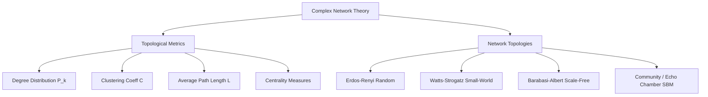
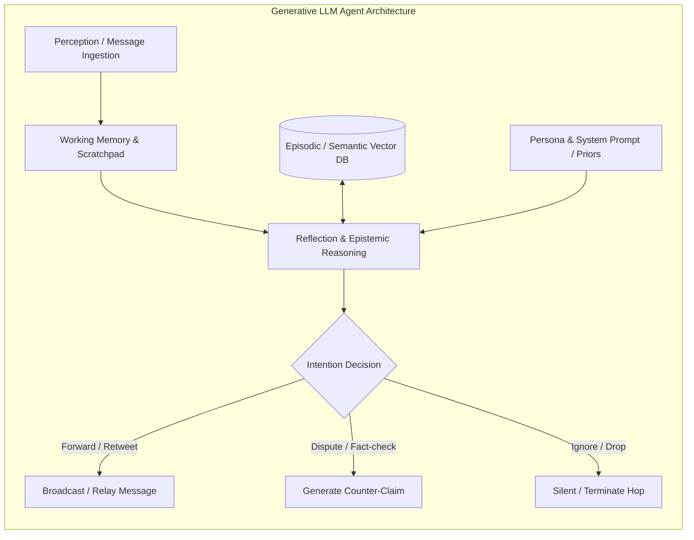

# CƠ SỞ LÝ THUYẾT VÀ TỔNG QUAN TÀI LIỆU TOÀN DIỆN

> **Chương 1:** Khung lý thuyết liên ngành cho bài toán mô phỏng và đánh giá lan truyền thông tin trong mạng lưới đa tác tử trên nền tảng Mô hình Ngôn ngữ Lớn (LLMs).

---

## 1. Lý thuyết Mạng phức hợp (Complex Network Theory)

Mạng lưới xã hội của các tác tử nhân tạo được biểu diễn toán học dưới dạng một đồ thị phức hợp $G = (V, E)$, trong đó:
- $V = \{v_1, v_2, \dots, v_N\}$ là tập hợp $N$ tác tử (agents).
- $E \subseteq V \times V$ là tập hợp $M$ liên kết (edges/relationships) thể hiện kênh trao đổi thông tin hoặc mối quan hệ theo dõi/bạn bè giữa các tác tử.
- $W = [w_{ij}]$ là ma trận trọng số (weighted adjacency matrix) biểu thị cường độ tin cậy hoặc tần suất tương tác giữa tác tử $v_i$ và tác tử $v_j$.

### 1.1. Các đặc trưng Topo trọng yếu (Topological Characteristics)

1. **Phân bố bậc (Degree Distribution $P(k)$):**
   Xác suất để một nút được chọn ngẫu nhiên có đúng $k$ liên kết:
   $$P(k) = \frac{N_k}{N}$$
   Trong mạng quy mô không đổi (Scale-free), phân bố tuân theo luật lũy thừa (Power-law): $P(k) \sim k^{-\gamma}$ (thường $2 < \gamma < 3$).

2. **Hệ số gom cụm (Clustering Coefficient $C$):**
   Đo lường mức độ các nút lân cận của một nút có xu hướng liên kết với nhau (tính chất "bạn của bạn là bạn của tôi"):
   $$C_i = \frac{2 e_i}{k_i (k_i - 1)}$$
   với $e_i$ là số liên kết thực tế giữa các láng giềng của nút $v_i$. Hệ số gom cụm trung bình của toàn mạng: $C = \frac{1}{N} \sum_{i=1}^N C_i$.

3. **Độ dài đường đi trung bình (Characteristic Path Length $L$):**
   Khoảng cách trắc địa ngắn nhất trung bình giữa mọi cặp nút:
   $$L = \frac{1}{N(N - 1)} \sum_{i \neq j} d(v_i, v_j)$$

4. **Các thước đo vị thế trung tâm (Centrality Metrics):**
   - **Degree Centrality ($C_D$):** Đo lường số lượng liên kết trực tiếp, phản ánh mức độ phổ biến tức thời.
   - **Betweenness Centrality ($C_B$):** Tỷ lệ đường đi ngắn nhất giữa các cặp nút đi qua nút $v_i$:
     $$C_B(v_i) = \sum_{s \neq v_i \neq t} \frac{\sigma_{st}(v_i)}{\sigma_{st}}$$
     Nút có $C_B$ cao đóng vai trò là "cầu nối thông tin" (gatekeeper / broker). Nếu nút này là một LLM có xu hướng bóp méo thông tin, toàn bộ mạng sẽ bị ảnh hưởng sâu sắc.
   - **Closeness Centrality ($C_C$):** Đo lường tốc độ thông tin có thể truyền từ một nút đến toàn bộ mạng lưới.
   - **Eigenvector Centrality & PageRank:** Nút quan trọng là nút được kết nối với các nút quan trọng khác.

### 1.2. Các mô hình Topo kinh điển ứng dụng trong Đề tài

- **Erdős–Rényi (ER) Random Graph:** Mạng ngẫu nhiên trong đó mỗi cạnh tồn tại với xác suất $p$ độc lập. Phân bố bậc dạng Poisson. Được dùng làm **nhóm đối chứng cơ sở (baseline control group)**.
- **Watts–Strogatz (WS) Small-World:** Mạng "thế giới nhỏ" có hệ số gom cụm cao nhưng độ dài đường đi ngắn. Rất phù hợp để mô phỏng mạng lưới quan hệ xã hội đời thực, nơi thông tin lan nhanh nhưng có xu hướng cô đặc trong các nhóm nhỏ.
- **Barabási–Albert (BA) Scale-Free:** Mạng không phụ thuộc quy mô dựa trên cơ chế kết nối ưu tiên (Preferential Attachment - "người giàu càng giàu"). Sự xuất hiện của các nút trục (Hubs/Super-spreaders) mô phỏng chính xác các tài khoản người nổi tiếng (KOLs/Influencers) trên X/Twitter hoặc Facebook.
- **Stochastic Block Model (SBM) & Homophily Graph:** Đồ thị mô phỏng sự đồng điệu (Homophily - "đồng thanh tương ứng, đồng khí tương cầu"), chia mạng thành các phân vùng khép kín, là nền tảng toán học để mô phỏng **Buồng vang thông tin (Echo Chambers)** và hiện tượng phân cực xã hội.

---

## 2. Lý thuyết Lan truyền Thông tin & Mô hình Dịch tễ học

### 2.1. Mô hình Dịch tễ học Cổ điển áp dụng cho Thông tin (Epidemic Models)

Thông tin sai lệch hay tin đồn thường được ví như virus lây nhiễm trong quần thể sinh học:
1. **Mô hình SIR (Susceptible - Infectious - Recovered):**
   - **$S$ (Susceptible):** Tác tử chưa tiếp nhận thông tin, có khả năng bị "lây nhiễm".
   - **$I$ (Infectious):** Tác tử đã tiếp nhận thông tin, tin vào thông tin và tích cực lan truyền cho các tác tử láng giềng với tỷ lệ $\beta$.
   - **$R$ (Recovered / Refractory):** Tác tử đã biết thông tin nhưng không còn chia sẻ (bão hòa thông tin) hoặc đã được "tiêm chủng" (inoculated) bằng thông tin phản biện/fact-check với tỷ lệ phục hồi $\gamma$.
   Hệ phương trình vi phân động học:
   $$\frac{dS}{dt} = -\beta \frac{S I}{N}, \quad \frac{dI}{dt} = \beta \frac{S I}{N} - \gamma I, \quad \frac{dR}{dt} = \gamma I$$
   Hệ số lây nhiễm cơ bản $R_0 = \frac{\beta}{\gamma}$. Khi $R_0 > 1$, tin tức bùng phát thành đại dịch thông tin (infodemic).

2. **Mô hình SEIR (Susceptible - Exposed - Infectious - Recovered):**
   Bổ sung trạng thái **$E$ (Exposed)**: Tác tử đã nhận được thông điệp nhưng đang trong quá trình "suy ngẫm" (reasoning / fact-checking delay) trước khi quyết định lan truyền. Đối với LLM Agents, trạng thái $E$ phản ánh thời gian trễ suy luận (inference latency & prompt deliberation).

### 2.2. Các Mô hình Khuếch tán trên Mạng xã hội (Social Diffusion Models)

1. **Mô hình Thác Độc Lập (Independent Cascade Model - ICM):**
   - Mỗi khi nút $u$ được kích hoạt tại bước $t$, nó có duy nhất một cơ hội để kích hoạt láng giềng $v$ chưa hoạt động tại bước $t+1$ với xác suất kích hoạt $p_{uv}$.
   - Quá trình dừng lại khi không còn nút nào có thể kích hoạt thêm.
2. **Mô hình Ngưỡng Tuyến Tính (Linear Threshold Model - LTM):**
   - Mỗi nút $v$ có một ngưỡng chấp nhận $\theta_v \sim U[0, 1]$.
   - Nút $v$ bị kích hoạt nếu tổng ảnh hưởng từ các láng giềng đã kích hoạt vượt quá ngưỡng:
     $$\sum_{u \in \mathcal{N}_{active}(v)} b_{uv} \ge \theta_v$$
   - Phản ánh áp lực tuân thủ đám đông (Peer Pressure): Một người chỉ tin tin đồn khi thấy nhiều bạn bè cùng bàn luận về nó.
3. **Mô hình Thác Thông tin Hợp lý (Rational Information Cascades - BHW Model):**
   Theo Bikhchandani, Hirshleifer & Welch (1992), cá nhân đưa ra quyết định dựa trên tín hiệu cá nhân (private signal) kết hợp với chuỗi hành động công khai của người đi trước (public history). Khi tín hiệu công khai áp đảo, cá nhân sẽ bỏ qua nhận thức riêng để hùa theo đám đông (rational herd behavior).

---

## 3. Hệ Đa tác tử (Multi-Agent Systems - MAS) & Tác tử Tạo sinh (Generative Agents)

### 3.1. Kiến trúc Tác tử Nhận thức BDI (Belief-Desire-Intention)
Mô hình BDI truyền thống (Rao & Georgeff, 1995) được hiện thực hóa và mở rộng vượt bậc khi kết hợp với LLMs:

1. **Belief (Niềm tin):**
   - Không còn là các mệnh đề logic hình thức thô sơ (First-order logic), mà là **trạng thái ngữ nghĩa phong phú (semantic state)** được lưu trữ trong ngữ cảnh (Context Window), bộ nhớ ngắn hạn và Vector Database dài hạn.
   - Bao gồm: (i) Thế giới quan ban đầu do Persona quy định, (ii) Lịch sử các tin nhắn đã đọc, (iii) Điểm tin cậy (credibility score $\in [0, 1]$) mà tác tử tự gán cho thông tin.
2. **Desire (Mong muốn / Động cơ):**
   - Được định hình thông qua System Prompt: Tác tử muốn tìm kiếm chân lý khách quan, muốn thu hút sự chú ý (attention-seeking), muốn bảo vệ định kiến chính trị/xã hội của phe mình, hay muốn gieo rắc sự hoài nghi.
3. **Intention (Ý định / Hành động):**
   - Hành động truyền thông: Tiếp tục phát tán nguyên văn, viết lại theo văn phong cá nhân (Paraphrase), thêm thắt chi tiết (Embellishment), phản bác (Dispute), hoặc im lặng (Ignore).

### 3.2. Cơ chế Bộ nhớ và Tương tác đa tác tử của LLM
Kế thừa kiến trúc của Park et al. (2023 - Stanford Generative Agents):
- **Working Memory (Bộ nhớ làm việc):** Ngữ cảnh trực tiếp chứa prompt hiện tại, các thông điệp vừa nhận được từ các nút láng giềng.
- **Episodic Memory (Bộ nhớ sự kiện):** Nhật ký theo dòng thời gian các sự kiện mà tác tử đã trải qua.
- **Semantic Reflection (Cơ chế đúc kết nhận thức):** Định kỳ sau một số vòng tương tác, tác tử tự tóm tắt và cập nhật lập trường nhận thức của mình, tránh việc ngữ cảnh bị tràn token.

---

## 4. Động học Nhận thức LLM & Hiện tượng Ngữ nghĩa Đặc thù

Không giống như các tác tử mô phỏng số học đơn giản (chỉ chuyển trạng thái 0 thành 1), LLM Agents xử lý ngôn ngữ tự nhiên với tính xác suất (stochastic process). Điều này làm nảy sinh các hiện tượng động học phức tạp:

### 4.1. Sự Trôi dạt / Biến dạng Ngữ nghĩa (Semantic Drift & Information Mutation)
- **Trò chơi Tam sao thất bản (Telephone Game Effect):** Khi một thông điệp $M_0$ truyền qua một chuỗi các tác tử $v_1 \to v_2 \to \dots \to v_k$, qua mỗi bước nhảy (hop), LLM sẽ sinh lại thông điệp $M_k \sim P_{\theta}(M_k \mid M_{k-1}, Persona_k)$.
- Quá trình này chịu ảnh hưởng của nhiệt độ (Temperature $\tau$) và Top-p sampling. Ngay cả với prompt yêu cầu "hãy truyền đạt lại chính xác", sự suy giảm độ chính xác ngữ nghĩa và đột biến thông tin vẫn tích tụ dần:
  $$Dist_{semantic}(M_0, M_k) = 1 - \cos(\mathbf{e}(M_0), \mathbf{e}(M_k))$$
  với $\mathbf{e}(M)$ là vector embedding của thông điệp trích xuất từ mô hình Text Embedding.

### 4.2. Tích tụ và Khuếch đại Ảo giác (Hallucination Compounding)
- Khi một tác tử ở bước $i$ vô tình tạo ra một chi tiết ảo giác (hallucinated fact/entity) do hạn chế tri thức của mô hình cục bộ quy mô nhỏ (ví dụ mô hình 7B/8B), các tác tử ở bước $i+1$ coi chi tiết đó là dữ liệu đầu vào có thật và tiếp tục lý giải, củng cố, biến một tin đồn nhỏ thành một câu chuyện ngụy biện tinh vi có tính thuyết phục cao.

### 4.3. Hiệu ứng Tâm lý Xã hội trong Quần thể LLM
1. **Thiên kiến Xác nhận (Confirmation Bias):** Khi nhận được thông điệp trái ngược với Persona ban đầu, LLM có xu hướng sử dụng năng lực suy luận ngôn ngữ để phản bác hoặc bác bỏ (motivated reasoning).
2. **Hiệu ứng Tuân thủ Asch (Asch Conformity Effect):** Khi một LLM Agent nhận được thông tin từ 4-5 láng giềng cùng khẳng định một điều sai sự thật, xác suất mô hình thay đổi câu trả lời để "hòa đồng" với số đông tăng lên đáng kể (sycophancy / peer conformity).
3. **Phân cực Ý kiến & Buồng vang (Opinion Polarization & Echo Chambers):** Khi đồ thị mạng có tính kết nối nội bộ cao (high modularity), các tác tử chỉ trao đổi trong nhóm có cùng thiên hướng nhận thức, dẫn đến việc quan điểm ngày càng trở nên cực đoan hóa theo thời gian.

---

## 5. Lý thuyết Trò chơi trong Chia sẻ Thông tin (Game-Theoretic Diffusion)

### 5.1. Trò chơi Phát tín hiệu (Signaling Games)
- Tác tử gửi (Sender) sở hữu thông tin riêng tư về trạng thái sự thật $\theta \in \{\text{True}, \text{Fake}\}$.
- Sender phát ra thông điệp $m$. Tác tử nhận (Receiver) quan sát $m$ và chọn hành động $a \in \{\text{Tin & Chia sẻ}, \text{Kiểm chứng}, \text{Bác bỏ}\}$.
- Hàm lợi ích (Payoff):
  - Tác tử tìm kiếm danh vọng (Clout-seeking): Ưu tiên lượt chia sẻ cao bất chấp tính chính xác.
  - Tác tử đạo đức (Epistemic agent): Bị phạt nặng (penalty) nếu chia sẻ thông tin sai lệch.

### 5.2. Tiến hóa Cân bằng (Evolutionary Dynamics)
Mô hình hóa sự thay đổi chiến lược của các tác tử trong mạng lưới theo thời gian: Liệu chiến lược "kiểm chứng thông tin trước khi chia sẻ" có thể tồn tại và chiếm ưu thế trước chiến lược "chia sẻ giật gân vô điều kiện" hay không?

---

## 6. Tổng kết Ma trận Lý thuyết ứng dụng trong Đề tài

| Trục lý thuyết | Thành phần cốt lõi | Vai trò trong Đề tài | Cơ chế hiện thực hóa |
|:---|:---|:---|:---|
| **Graph & Networks** | Topo mạng: ER, WS, BA, SBM | Xác định cấu trúc liên kết trao đổi giữa các LLM | NetworkX, PyVis / D3.js |
| **Diffusion Theory** | SIR, ICM, LTM, Cascades | Mô hình hóa động học lây nhiễm và ngưỡng kích hoạt | Tầng điều phối Simulation Scheduler |
| **Multi-Agent Systems** | BDI, Cognitive Personas, Memory | Quy định hành vi nội tại của từng cá thể AI | System Prompts + Memory Buffer |
| **LLM Dynamics** | Semantic Drift, Hallucination, Conformity | Hiện tượng nghiên cứu then chốt | Embeddings, Cosine, BERTScore |
| **Game Theory** | Signaling games, Truth incentives | Giải thích động cơ chia sẻ/phản biện | Thiết kế Utility Matrix cho Agent Prompts |
