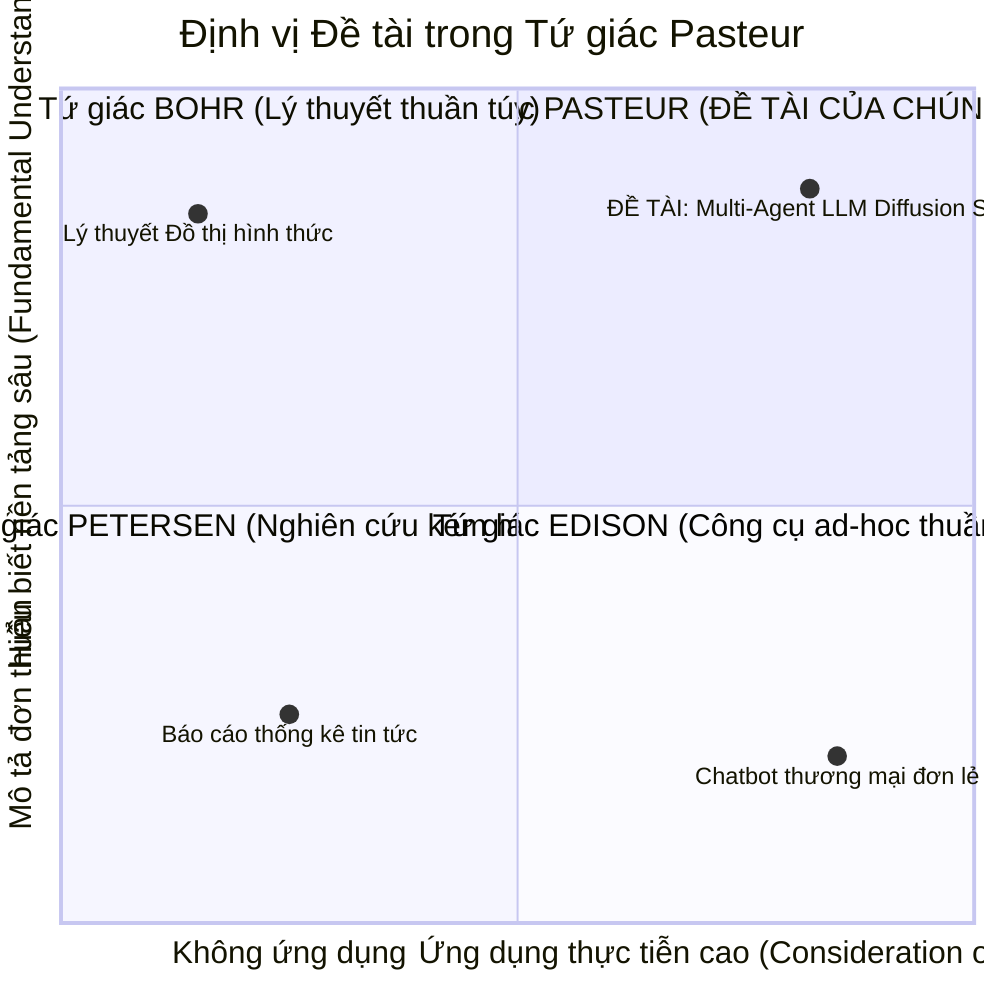

# MÔ HÌNH TỨ GIÁC PASTEUR VÀ ĐỊNH VỊ NGHIÊN CỨU

> **Chương 2:** Định vị triết lý khoa học của đề tài theo Mô hình Tứ giác Pasteur (Donald E. Stokes, 1997) - Nghiên cứu cơ bản có định hướng ứng dụng thực tiễn (Use-Inspired Basic Research).

---

## 1. Giới thiệu Mô hình Tứ giác Pasteur (Pasteur's Quadrant)

Trong tác phẩm kinh điển *"Pasteur's Quadrant: Basic Science and Technological Innovation"* (1997), nhà khoa học chính trị học Donald E. Stokes đã chỉ ra sự bất cập của mô hình tuyến tính truyền thống (vốn chia ranh giới cứng nhắc giữa *Nghiên cứu cơ bản thuần túy* và *Nghiên cứu ứng dụng thuần túy*). Ông đề xuất một khung phân loại 2 chiều dựa trên 2 câu hỏi bản lề:
1. **Tìm kiếm hiểu biết cơ bản nền tảng?** (*Quest for fundamental understanding?*)
2. **Cân nhắc mục đích sử dụng / ứng dụng thực tiễn?** (*Consideration of use?*)

```
             TÌM KIẾM HIỂU BIẾT NỀN TẢNG?
                  (Fundamental Understanding)
                   CÓ (YES)          KHÔNG (NO)
            ┌───────────────────┬───────────────────┐
      CÓ    │   TỨ GIÁC PASTEUR │   TỨ GIÁC EDISON  │
    (YES)   │   (Nghiên cứu cơ  │   (Nghiên cứu ứng │
            │   bản định hướng  │   dụng thuần túy) │
 CÂN NHẮC   │     ứng dụng)     │                   │
MỤC ĐÍCH    ├───────────────────┼───────────────────┤
ỨNG DỤNG?   │    TỨ GIÁC BOHR   │  TỨ GIÁC PETERSEN │
 (Use)      │   (Nghiên cứu cơ  │  (Nghiên cứu mô tả│
    KHÔNG   │   bản thuần túy)  │   kém hiệu quả)   │
    (NO)    │                   │                   │
            └───────────────────┴───────────────────┘
```

### 1.1. Bốn góc phần tư của Mô hình

1. **Góc Niels Bohr (Pure Basic Research - Nghiên cứu cơ bản thuần túy):**
   - Động lực duy nhất là mở rộng ranh giới tri thức nhân loại mà không quan tâm đến tính khả dụng thực tế trước mắt. Ví dụ điển hình: Niels Bohr nghiên cứu cấu trúc nguyên tử và cơ học lượng tử đầu thế kỷ 20.
2. **Góc Thomas Edison (Pure Applied Research - Nghiên cứu ứng dụng thuần túy):**
   - Tập trung hoàn toàn vào việc chế tạo sản phẩm thương mại hoặc giải quyết một vấn đề cụ thể mà không bận tâm đến việc phát hiện các quy luật tự nhiên tổng quát. Ví dụ: Edison phát minh bóng đèn sợi đốt thông qua hàng nghìn phép thử vật liệu.
3. **Góc Louis Pasteur (Use-Inspired Basic Research - Nghiên cứu cơ bản định hướng ứng dụng):**
   - Sự giao thoa đỉnh cao: Vừa đi sâu giải mã các quy luật nền tảng của tự nhiên, vừa hướng trực tiếp đến việc giải quyết những vấn đề cấp bách của thực tiễn. Louis Pasteur vừa phát hiện ra nguyên lý vi sinh học của bệnh tật (nền tảng sinh học), vừa bào chế thành công vắc-xin bệnh dại và kỹ thuật thanh trùng bảo quản thực phẩm (ứng dụng thực tiễn).
4. **Góc Petersen (Descriptive / Peripheral Research):**
   - Nghiên cứu mô tả đơn thuần, không đóng góp lý thuyết mới và cũng không tạo ra sản phẩm ứng dụng rõ ràng.

---

## 2. Định vị Đề tài trong Tứ giác Pasteur

Đề tài: **"Nghiên cứu, phát triển công cụ mô phỏng và đánh giá thực nghiệm quá trình lan truyền thông tin trong mạng lưới đa tác tử trên các mô hình ngôn ngữ lớn (LLMs)"** được định vị chính xác tại **Góc phần tư Pasteur (Use-Inspired Basic Research)**:



### 2.1. Trục "Tìm kiếm hiểu biết nền tảng" (Fundamental Understanding)

Đề tài không đơn thuần là một dự án lập trình phần mềm, mà giải quyết các câu hỏi khoa học nền tảng chưa từng có tiền lệ trước kỷ nguyên LLM:

1. **Bản chất của Động học Ngữ nghĩa Quần thể (Generative Collective Dynamics):**
   - Trước đây, lý thuyết lan truyền (Epidemic/Diffusion) chỉ gán cho mỗi nút mạng một trạng thái nhị phân (0 hoặc 1, Nhiễm hoặc Khỏe).
   - Với LLM, trạng thái của nút là một không gian ngữ nghĩa nhiều chiều vô hạn ($d$-dimensional semantic space). Hiểu biết mới cần tìm là: **Quy luật biến dạng ngữ nghĩa (Semantic Entropy & Drift) thay đổi như thế nào theo hàm số của khoảng cách bước nhảy (hop distance), nhiệt độ sinh (temperature), và cấu trúc topo mạng?**
2. **Cơ chế Lan truyền Niềm tin trong Quần thể Dị thể (Epistemic Dynamics in Heterogeneous AI):**
   - Khi một mạng lưới kết hợp giữa các mô hình nhỏ cục bộ (Ollama: Llama-3-8B, Qwen-2.5-7B) và các siêu mô hình đám mây (Cloud: GPT-4o, Gemini 2.0), cơ chế phân cấp nhận thức diễn ra như thế nào? Mô hình lớn có đóng vai trò là "nút ổn định chân lý" (epistemic anchors) để ngăn ngừa sự tích tụ ảo giác của mô hình nhỏ hay không?
3. **Hiện tượng Ngưỡng và Điểm lật (Tipping Points & Phase Transitions):**
   - Xác định điều kiện ranh giới toán học và thực nghiệm để một tin đồn/tin sai lệch hoặc bùng phát toàn mạng, hoặc bị dập tắt bởi các tác tử phản biện (Fact-checking agents).

### 2.2. Trục "Cân nhắc mục đích ứng dụng thực tiễn" (Consideration of Use)

Nghiên cứu hướng tới việc tạo ra sản phẩm phần mềm hoàn chỉnh, giải quyết trực tiếp các thách thức lớn của thời đại thông tin và an toàn AI:

1. **Công cụ Đánh giá Rủi ro An ninh Thông tin (Information Warfare & Disinformation Sandbox):**
   - Cung cấp cho các cơ quan quản lý, viện nghiên cứu truyền thông một môi trường "hộp cát" (sandbox) mô phỏng an toàn để kiểm thử các kịch bản tấn công thông tin diện rộng (AI botnet attacks) mà không làm ô nhiễm mạng xã hội thực tế.
2. **Chiến lược Tiêm chủng Thông tin (Inoculation & Counter-measure Strategy):**
   - Giúp các tổ chức y tế công cộng hoặc tổ chức chống tin giả xác định **vị trí tối ưu trong mạng lưới** (optimal node placement based on betweenness/eigenvector centrality) để đưa các tác tử fact-check vào hoạt động nhằm đạt hiệu quả dập tin giả cao nhất với chi phí tính toán thấp nhất.
3. **Mô hình Kiến trúc Hỗn hợp Tiết kiệm Chi phí (Cost-Effective Hybrid Architecture):**
   - Đưa ra khuyến nghị thực tế cho các doanh nghiệp: Làm thế nào để xây dựng hệ thống đa tác tử quy mô lớn bằng cách tận dụng 80-90% mô hình cục bộ mã nguồn mở (chạy Ollama miễn phí chi phí API) kết hợp 10-20% mô hình Cloud cao cấp mà vẫn đảm bảo độ tin cậy và không suy thoái dữ liệu.

---

## 3. Ý nghĩa Khoa học và Giá trị Thực tiễn của Đề tài

### 3.1. Ý nghĩa Khoa học (Scientific Merit)
- Đóng góp vào nhánh nghiên cứu mới nổi: **Khoa học Xã hội Tính toán dựa trên Tác tử Tạo sinh (Generative Agent-Based Computational Social Science)**.
- Mở rộng các mô hình lan truyền cổ điển (ICM, LTM, SIR) thành **Mô hình Lan truyền Ngữ nghĩa Đa chiều (Multi-dimensional Semantic Cascade Models)**.
- Xây dựng phương pháp luận đo lường thực nghiệm tính sai lệch và trôi dạt ngữ nghĩa thông qua Text Embeddings và LLM-as-a-Judge.

### 3.2. Giá trị Thực tiễn (Practical Utility)
- **Sản phẩm phần mềm mã nguồn mở:** Bộ công cụ hoàn chỉnh gồm Core Engine, REST API, Web Dashboard trực quan hóa tương tác mạng lưới thời gian thực.
- **Tài liệu hướng dẫn thực nghiệm & Bộ dữ liệu kiểm chuẩn (Benchmark Dataset):** Cung cấp bộ kịch bản mẫu (tin khoa học, tin đồn y tế, tin gián điệp mạng) có chú thích để cộng đồng tái sử dụng.
- **Tiết kiệm tài nguyên nghiên cứu:** Kiến trúc ưu tiên Local LLMs giúp các nhóm nghiên cứu sinh viên/trường đại học tại Việt Nam có thể thực nghiệm mô phỏng quy mô lớn mà không bị rào cản chi phí token đám mây đắt đỏ.
