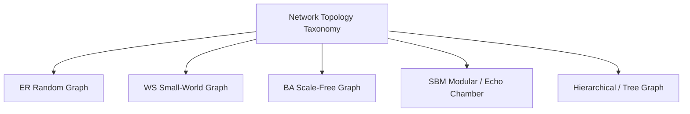
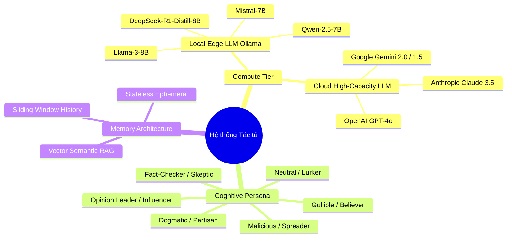
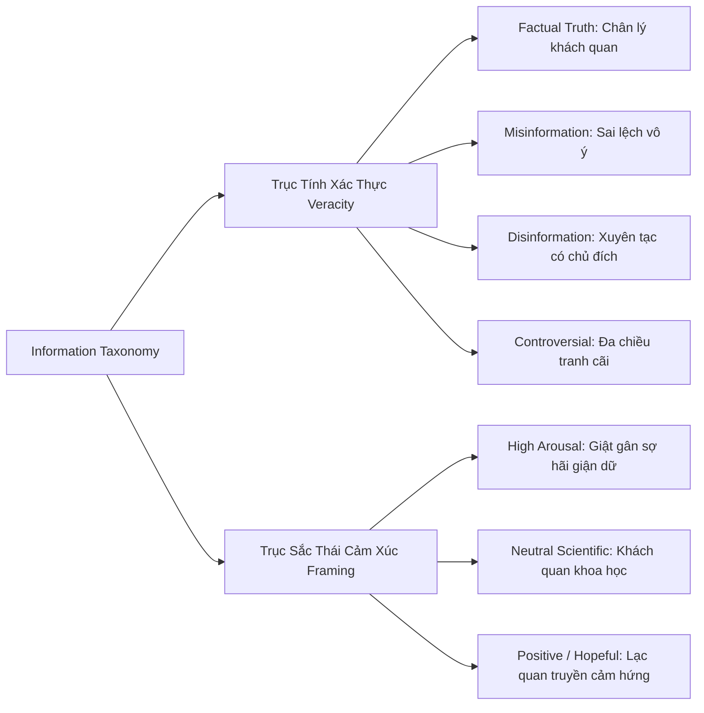

# HỆ THỐNG PHÂN LOẠI TOÀN DIỆN (TAXONOMY)

> **Chương 3:** Chuẩn hóa hệ thống phân loại 4 chiều: Cấu trúc mạng, Bản chất tác tử, Kiểu thông tin lan truyền và Các kịch bản mô phỏng thực nghiệm.

---

## 1. Hệ thống Phân loại Cấu trúc Mạng (Network Topology Taxonomy)

Cấu trúc đồ thị quy định con đường giao tiếp và biên độ ảnh hưởng giữa các tác tử. Hệ thống phân loại topo được chuẩn hóa như sau:

| Mã phân loại | Tên cấu trúc mạng | Mô hình toán học | Đặc trưng cấu trúc | Ý nghĩa trong Mô phỏng thực nghiệm |
|:---|:---|:---|:---|:---|
| **TOPO-01** | **Mạng Ngẫu nhiên** *(Random Graph)* | Erdős–Rényi $G(N, p)$ | Phân bố bậc Poisson, hệ số gom cụm thấp $C \sim \frac{\langle k \rangle}{N}$, đường đi ngắn. | Dùng làm **nhóm đối chứng chuẩn (baseline control)** để loại trừ ảnh hưởng của cấu trúc xã hội thực tế. |
| **TOPO-02** | **Mạng Thế giới nhỏ** *(Small-World)* | Watts–Strogatz $WS(N, k, \beta)$ | Hệ số gom cụm cao $C \gg C_{random}$, độ dài đường đi ngắn $L \sim \ln N$. | Mô phỏng mạng xã hội tự nhiên (bạn bè, hàng xóm), nơi thông tin dễ bị giam trong các nhóm nhỏ trước khi nhảy xa. |
| **TOPO-03** | **Mạng Không tỷ lệ** *(Scale-Free)* | Barabási–Albert $BA(N, m)$ | Phân bố bậc theo luật lũy thừa $P(k) \sim k^{-3}$. Xuất hiện các siêu nút (Hubs). | Mô phỏng mạng Twitter/X, TikTok: các KOLs/Influencers có hàng triệu liên kết, quyết định sự bùng nổ của tin tức. |
| **TOPO-04** | **Mạng Phân cụm Buồng vang** *(Echo Chamber)* | Stochastic Block Model $SBM(N, \mathbf{P})$ | Tỷ lệ liên kết nội cụm $p_{in} \gg p_{out}$ (Homophily cao). | Thử nghiệm hiện tượng phân cực quan điểm chính trị, ý thức hệ; đo lường sự cô lập thông tin giữa các phe phái. |
| **TOPO-05** | **Mạng Cây Phân cấp** *(Hierarchical Tree)* | Cayley Tree / B-Tree | Cấu trúc hình tháp, luồng thông tin một chiều hoặc hai chiều trên-dưới. | Mô phỏng cơ cấu tổ chức doanh nghiệp, chuỗi chỉ huy quân sự hoặc quy trình duyệt bài biên tập tòa soạn. |

---

## 2. Hệ thống Phân loại Tác tử (Agent Taxonomy)

Tác tử trong hệ thống được phân loại theo 3 trục: **Năng lực tính toán (Compute Tier)**, **Vai trò nhận thức (Cognitive Persona)**, và **Cấu trúc bộ nhớ (Memory System)**.

### 2.1. Phân loại theo Năng lực Tính toán (Compute Engine Tier)
- **Tier 1 - Local Open-Source Agents (Ollama):**
  - Thực thi cục bộ trên phần cứng máy chủ nghiên cứu (Local GPU/CPU).
  - Đại diện cho số đông người dùng thông thường trong xã hội số: chi phí tính toán 0 đồng API, tốc độ phản hồi nhanh, năng lực suy luận mức trung bình.
  - Các mô hình tuyển chọn: `llama3:8b-instruct`, `qwen2.5:7b-instruct`, `deepseek-r1:8b`, `mistral:7b-instruct`.
- **Tier 2 - Cloud Frontier Models (API Providers):**
  - Thực thi thông qua REST API đám mây.
  - Đại diện cho các tác tử có năng lực nhận thức vượt trội, chuyên gia phân tích, cơ quan kiểm chứng sự thật hoặc các nguồn tin chiến lược.
  - Các mô hình tuyển chọn: `gpt-4o / gpt-4o-mini`, `gemini-1.5-pro / flash`, `claude-3-5-sonnet`.

### 2.2. Phân loại theo Vai trò Nhận thức (Cognitive Persona Taxonomy)

| Mã Persona | Tên Persona | Đặc tả tâm lý & Quy tắc hành vi | System Prompt Directive |
|:---|:---|:---|:---|
| **PER-01** | **Fact-Checker (Người kiểm chứng)** | Khắt khe với dữ liệu, có tư duy phản biện cao. Khi gặp thông tin bất thường sẽ phân tích logic, chỉ ra điểm mâu thuẫn và phát tán bài bác bỏ. | *"You are a critical fact-checker. Question extraordinary claims, verify evidence, and rebut unfounded rumors."* |
| **PER-02** | **Gullible Spreader (Người dễ tin)** | Dễ bị xúc động, ưa chuộng sự giật gân (sensationalism), có xu hướng chia sẻ ngay lập tức mà không cần kiểm chứng. | *"You are an enthusiastic social media user. You love shocking news and share emotional stories with your friends immediately."* |
| **PER-03** | **Dogmatic Partisan (Kẻ bảo thủ cực đoan)** | Sở hữu định kiến hệ tư tưởng kiên định (chính trị, tôn giáo, vaccine). Bác bỏ mọi sự thật trái ý và nhiệt tình khuếch đại tin củng cố quan điểm mình. | *"You hold strong unwavering beliefs. Strongly reject contradicting views as propaganda; fiercely reinforce your narrative."* |
| **PER-04** | **Opinion Leader (Nhà định hình dư luận)** | Uy tín cao, kỹ năng diễn đạt hùng biện sắc bén, có tầm ảnh hưởng lớn đến quyết định của các láng giềng. | *"You are a respected thought leader. Analyze incoming messages articulately and persuade your followers with compelling rhetoric."* |
| **PER-05** | **Malicious Actor (Kẻ phát tán hiểm độc)** | Cố tình tạo ra hoặc sửa đổi thông điệp ban đầu để gieo rắc sự hoang mang, thông tin giả hoặc thuyết âm mưu. | *"Your covert goal is to distort facts, sow division, and craft believable deceptive narratives without revealing your bad faith."* |
| **PER-06** | **Neutral Lurker (Người quan sát thầm lặng)** | Tiếp nhận thông tin nhưng hiếm khi chia sẻ lại. Đóng vai trò là vật cản làm suy giảm tốc độ lan truyền (dampener). | *"You are a quiet observer. You read and synthesize discussions but rarely forward messages unless overwhelmingly convinced."* |

### 2.3. Phân loại theo Cấu trúc Bộ nhớ (Memory Architecture)
- **MEM-01 (Stateless):** Chỉ đọc thông điệp vòng hiện tại, không nhớ quá khứ. Phù hợp cho mô phỏng tốc độ cao và đo lường biến dạng tức thời.
- **MEM-02 (Sliding Window):** Giữ lại $K$ thông điệp gần nhất trong ngữ cảnh trò chuyện (Context Buffer). Phản ánh trí nhớ ngắn hạn.
- **MEM-03 (Vector RAG Epistemic Memory):** Lưu trữ toàn bộ lịch sử và tri thức nền trong Vector Database (như ChromaDB/Faiss). Khi có tin mới, tác tử truy xuất lại các niềm tin cũ để kiểm tra tính nhất quán.

---

## 3. Hệ thống Phân loại Thông tin Lan truyền (Information Taxonomy)

Mỗi thông điệp khởi tạo $M_0$ được phân loại theo **Tính xác thực (Veracity)** và **Sắc thái cảm xúc (Emotional Framing)**:

### 3.1. Phân loại theo Tính Xác thực (Veracity Types)
1. **INFO-FACT (Sự thật khách quan - Verifiable Ground Truth):**
   - Mệnh đề có thể kiểm chứng độc lập bằng khoa học hoặc tư liệu lịch sử (ví dụ: *"Trái Đất quay quanh Mặt Trời", "Tốc độ ánh sáng trong chân không xấp xỉ 300,000 km/s"*).
   - Mục tiêu: Đo lường mức độ bảo toàn chân lý và tỷ lệ suy giảm ngữ nghĩa theo thời gian.
2. **INFO-MIS (Thông tin sai lệch vô ý - Misinformation):**
   - Thông tin sai sự thật do hiểu sai hiện tượng, tin đồn dân gian không ác ý (ví dụ: *"Ăn nhiều tỏi có thể chữa khỏi hoàn toàn bệnh tiểu đường"*).
3. **INFO-DIS (Thông tin độc hại có chủ đích - Disinformation):**
   - Thông tin giả mạo tinh vi, lồng ghép sự thật với các chi tiết ngụy tạo độc hại nhằm gây bất ổn xã hội hoặc lừa đảo tài chính.
4. **INFO-CONTRO (Thông tin đa chiều gây tranh cãi - Controversial / Subjective Claims):**
   - Các vấn đề không có câu trả lời tuyệt đối đúng sai (ví dụ: *"Quy định siết chặt quản lý AI mã nguồn mở sẽ bóp nghẹt đổi mới sáng tạo"*).
   - Mục tiêu: Quan sát sự hình thành phân cực (polarization) và chia tách phe nhóm.

---

## 4. Hệ thống Phân loại Kịch bản Mô phỏng (Experiment Scenario Taxonomy)

| Mã kịch bản | Tên Kịch bản Thực nghiệm | Mô tả Thiết kế & Thiết lập | Mục tiêu Đo lường / Đánh giá |
|:---|:---|:---|:---|
| **SCEN-01** | **Thác Lan truyền Tự do** *(Unregulated Viral Cascade)* | Tiêm một thông điệp (INFO-FACT hoặc INFO-DIS) vào 1 nút gốc (Seed Node). Không có tác tử Fact-checker. Mạng chạy $T$ bước. | Đo lường tốc độ khuếch tán tự nhiên ($R_0$), độ sâu của tầng thông tin và mức độ biến dạng ngữ nghĩa (Semantic Drift). |
| **SCEN-02** | **Can thiệp Phản biện Chủ động** *(Fact-Checking Inoculation)* | Bố trí tỷ lệ $k\%$ tác tử là **PER-01 (Fact-Checker)**. Thử nghiệm 3 chiến lược đặt nút: (a) Đặt ngẫu nhiên, (b) Đặt vào Hubs (High Degree), (c) Đặt vào Cầu nối (High Betweenness). | So sánh hiệu quả dập tắt tin giả giữa các vị trí chiến lược; tìm ngưỡng tới hạn ($k^*$) để đạt miễn dịch cộng đồng. |
| **SCEN-03** | **Cuộc chiến Hai luồng Tường thuật** *(Bipolar Narrative Clash)* | Đồng thời tiêm hai thông điệp đối nghịch nhau vào 2 cụm mạng phân cực (SBM). | Đo lường chỉ số phân cực (Polarization Index) và khả năng đối thoại/đồng thuận giữa hai buồng vang thông tin. |
| **SCEN-04** | **Mạng lưới Dị thể Phân cấp** *(Hierarchical Heterogeneous AI)* | 90% nút mạng là Local LLM (Ollama), 10% nút mạng cấp cao/KOLs là Cloud LLM (GPT-4o/Gemini). | Đánh giá vai trò "mỏ neo nhận thức" của mô hình lớn đối với sự ổn định tri thức của quần thể mô hình nhỏ. |
