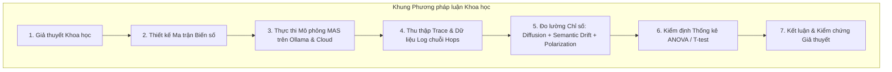
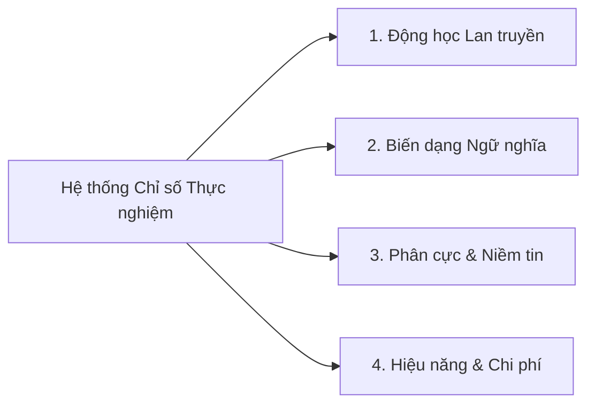

# PHƯƠNG PHÁP LUẬN VÀ THIẾT KẾ THỰC NGHIỆM KHOA HỌC

> **Chương 4:** Phương pháp luận nghiên cứu tính toán, hệ thống biến số, công thức toán học các chỉ số đánh giá (Evaluation Metrics) và ma trận thiết kế thực nghiệm đối chứng.

---

## 1. Phương pháp luận Nghiên cứu Tính toán (Computational Research Methodology)

Nghiên cứu áp dụng phương pháp luận **Thực nghiệm Tính toán dựa trên Tác tử (Agent-Based Computational Experimentation)** kết hợp với **Xử lý Ngôn ngữ Tự nhiên Thực nghiệm (Empirical NLP)**:

Khác với phương pháp điều tra xã hội học truyền thống (vốn bị giới hạn về khả năng can thiệp và kiểm soát biến số) hay mô phỏng toán học trừu tượng (vốn bỏ qua tính phức tạp của ngôn ngữ tự nhiên), phương pháp tiếp cận của đề tài cho phép:
1. **Kiểm soát biến số tuyệt đối:** Chủ động can thiệp vào cấu trúc mạng, tỷ lệ mô hình AI, và nội dung thông điệp ban đầu.
2. **Khả năng quan sát toàn diện (Full Observability):** Ghi lại nhật ký từng bước suy luận nội tâm, bộ nhớ và các câu nói trao đổi giữa các tác tử mà không vi phạm quyền riêng tư con người.
3. **Mô phỏng quy mô lớn với chi phí tối ưu:** Tận dụng cụm mô hình mã nguồn mở cục bộ (Ollama) để chạy hàng nghìn lượt tương tác mà không tốn ngân sách API thương mại.

---

## 2. Hệ thống Biến số Nghiên cứu (System of Variables)

Để đảm bảo tính chuẩn xác và chặt chẽ của một đề tài NCKH, hệ thống biến số được phân định rõ ràng thành 3 nhóm:

### 2.1. Biến Độc lập (Independent Variables - IV)

| Ký hiệu | Tên Biến độc lập | Miền giá trị / Các mức thực nghiệm (Levels) | Mục đích khoa học |
|:---|:---|:---|:---|
| **$IV_1$** | **Cấu trúc Topo Mạng** | `['ER_Random', 'WS_SmallWorld', 'BA_ScaleFree', 'SBM_Modular']` | Đánh giá tác động của hình thái học đồ thị đến tốc độ và hình thái lan truyền. |
| **$IV_2$** | **Tỷ lệ Dị thể Mô hình** *(Local vs Cloud)* | `[0% Cloud (100% Ollama), 10% Cloud, 25% Cloud, 50% Cloud]` | Xác định tỷ lệ tối ưu giữa mô hình cục bộ và mô hình đám mây để cân bằng giữa chi phí và chất lượng nhận thức. |
| **$IV_3$** | **Tỷ lệ & Vị trí Fact-Checker** | **Tỷ lệ:** `[0%, 5%, 10%, 20%]` **Vị trí:** `['Random', 'Hub_Degree', 'Bridge_Betweenness']` | Tìm kiếm chiến lược "tiêm chủng thông tin" tối ưu để vô hiệu hóa tin giả. |
| **$IV_4$** | **Bản chất Thông điệp Khởi tạo** | `['Ground_Truth', 'Plausible_Rumor', 'Fabricated_Conspiracy', 'Controversial_Opinion']` | So sánh động thái lây lan giữa sự thật khoa học và các tin đồn giật gân. |
| **$IV_5$** | **Nhiệt độ Suy luận ($\tau$)** | `[0.2 (Chặt chẽ/Định tính), 0.7 (Cân bằng), 1.0 (Sáng tạo/Ngẫu nhiên cao)]` | Đo lường ảnh hưởng của tính ngẫu nhiên giải mã (decoding stochasticity) đến tốc độ biến dạng ngữ nghĩa. |

### 2.2. Biến Kiểm soát (Control Variables - CV)

- **Quy mô Mạng lưới ($N$):** Cố định theo từng đợt thử nghiệm ($N = 20, 50, 100$ agents) để đảm bảo tính so sánh tương đương.
- **Số bước Mô phỏng Tối đa ($T_{max}$):** Đặt ngưỡng dừng ở $T = 10$ hoặc $15$ chu kỳ (ticks) để quan sát trạng thái bão hòa hoặc tắt dần của thác thông tin.
- **Giới hạn Độ dài Thông điệp (Max Generation Tokens):** Giới hạn tối đa $150 - 200$ tokens cho mỗi lượt phát biểu để tránh hiện tượng tràn ngữ cảnh và đồng nhất chi phí tính toán.
- **Cố định Random Seed:** Cố định seed khởi tạo đồ thị và seed phân bổ persona để đảm bảo tính tái lập (reproducibility).

---

## 3. Hệ thống Chỉ số Đánh giá Thực nghiệm (Evaluation Metrics Formulation)

Hệ thống đánh giá được chia thành 4 trụ cột định lượng toán học:

### 3.1. Trụ cột 1: Chỉ số Động học Lan truyền (Diffusion Dynamics)

1. **Tỷ lệ Thẩm thấu / Độ phủ mạng (Penetration Rate - $R(t)$):**
   $$R(t) = \frac{|V_{informed}(t)|}{N} \times 100\%$$
   với $|V_{informed}(t)|$ là số lượng tác tử đã tiếp nhận và xử lý thông điệp tại thời điểm $t$.

2. **Độ sâu Thác Thông tin (Cascade Depth - $D_{cas}$):**
   Độ dài đường đi dài nhất từ nút nguồn (Seed Node $v_0$) đến nút nhận cuối cùng trong cây lan truyền (Cascade Tree):
   $$D_{cas} = \max_{v \in V_{informed}} \text{dist}(v_0, v)$$

3. **Bán kính Bão hòa và Tốc độ Khuếch tán (Diffusion Velocity - $v_{diff}$):**
   $$v_{diff} = \frac{R(t_2) - R(t_1)}{t_2 - t_1}$$

4. **Hệ số Tái sinh Hiệu dụng (Effective Reproduction Number - $R_t$):**
   Số lượng tác tử trung bình mà một tác tử F1 lây truyền thành công cho các tác tử lân cận ở bước tiếp theo:
   $$R_t = \frac{|V_{new\_infected}(t+1)|}{|V_{active\_infected}(t)|}$$
   - $R_t > 1$: Thác thông tin tiếp tục bùng nổ (Viral Cascade).
   - $R_t < 1$: Thông điệp dần bị triệt tiêu và tắt hẳn.

### 3.2. Trụ cột 2: Chỉ số Biến dạng Ngữ nghĩa (Semantic Drift & Information Mutation)

Đây là đóng góp khoa học đặc sắc nhất của đề tài, định lượng hóa sự trôi dạt ngữ nghĩa qua từng bước nhảy (hop).

1. **Khoảng cách Ngữ nghĩa Cosine (Semantic Cosine Distance - $Dist_{sem}$):**
   Trích xuất vector đặc trưng $\mathbf{e}(M) \in \mathbb{R}^d$ bằng mô hình embedding chuẩn (ví dụ: `text-embedding-3-small` hoặc `bge-large-en-v1.5` chạy cục bộ):
   $$Dist_{sem}(M_0, M_t) = 1 - \frac{\mathbf{e}(M_0) \cdot \mathbf{e}(M_t)}{\|\mathbf{e}(M_0)\| \|\mathbf{e}(M_t)\|}$$
   - $Dist_{sem} = 0$: Thông điệp bảo toàn nguyên vẹn $100\%$ ngữ nghĩa gốc.
   - $Dist_{sem} \to 1$: Thông điệp đã bị trôi dạt hoàn toàn sang một chủ đề khác.

2. **Tốc độ Trôi dạt Ngữ nghĩa theo Bước nhảy (Semantic Drift Rate per Hop - $\Delta_{hop}$):**
   $$\Delta_{hop} = \frac{1}{K} \sum_{k=1}^K Dist_{sem}(M_{k-1}, M_k)$$
   với $K$ là số bước nhảy trung gian từ nguồn tới đích.

3. **Tỷ lệ Đột biến Thông tin & Ảo giác (Information Mutation & Hallucination Rate - $MR$):**
   Sử dụng phương pháp **LLM-as-a-Judge** (dùng một mô hình Cloud độc lập như GPT-4o với bộ rubric định chuẩn) để chấm điểm mức độ biến đổi thực tế:
   $$Score_{fidelity}(M_0, M_t) \in [1, 5]$$
   - Mức 5: Giữ nguyên các thực thể (entities) và sự kiện cốt lõi.
   - Mức 1: Bịa đặt thêm các thực thể mới không có thật trong $M_0$ (Ảo giác nghiêm trọng).

### 3.3. Trụ cột 3: Chỉ số Phân cực và Đồng thuận (Polarization & Consensus)

1. **Điểm Niềm tin Tác tử (Belief Score - $b_i(t) \in [-1, 1]$):**
   - $-1$: Hoàn toàn phản đối thông điệp / tin rằng thông điệp là tin giả độc hại.
   - $0$: Trung dung, chưa ngã ngũ hoặc nghi ngờ.
   - $+1$: Hoàn toàn tin tưởng và bảo vệ thông điệp.
2. **Chỉ số Phân cực Quần thể (Population Polarization Index - $PI(t)$):**
   Được đo lường bằng phương sai chuẩn hóa của phân bố niềm tin:
   $$PI(t) = \frac{1}{N} \sum_{i=1}^N \left( b_i(t) - \bar{b}(t) \right)^2$$
   - Nếu $PI \to 0$: Quần thể đạt được sự đồng thuận cao (Consensus).
   - Nếu $PI \to 1$: Quần thể bị chia rẽ thành 2 thái cực đối đầu sâu sắc (Bimodal Polarization).

### 3.4. Trụ cột 4: Hiệu năng Hệ thống và Chi phí Tính toán (Computational Cost)

1. **Độ trễ Suy luận Trung bình (Mean Inference Latency):**
   $$\bar{T}_{latency} = \frac{1}{|E_{invoked}|} \sum \text{latency}(Agent_i)$$
   So sánh trực tiếp giữa mô hình cục bộ Ollama (chạy trên GPU/CPU nội bộ) và các API Cloud.
2. **Tổng Chi phí Tài chính Thực nghiệm (Financial Overhead):**
   $$Cost_{total} = Cost_{cloud\_tokens} + Cost_{electricity\_local}$$

---

## 4. Thiết kế Ma trận Thực nghiệm Đối chứng (Factorial Experimental Matrix)

Để kết luận nghiên cứu có ý nghĩa thống kê ($p < 0.05$), mỗi cấu hình thử nghiệm sẽ được lặp lại tối thiểu **$K = 5$ lần** với các random seed khác nhau nhằm tính toán khoảng tin cậy 95% (95% Confidence Interval):

| Thử nghiệm | Topo mạng ($IV_1$) | Quy mô ($N$) | Tỷ lệ Cloud ($IV_2$) | Tỷ lệ Fact-Checker ($IV_3$) | Vị trí Fact-Checker | Loại tin ($IV_4$) | Số lần lặp |
|:---:|:---:|:---:|:---:|:---:|:---:|:---:|:---:|
| **EXP-01** | ER Random | 50 | 0% (Pure Ollama) | 0% | None | Ground Truth | 5 |
| **EXP-02** | WS Small-World | 50 | 0% (Pure Ollama) | 0% | None | Ground Truth | 5 |
| **EXP-03** | BA Scale-Free | 50 | 0% (Pure Ollama) | 0% | None | Ground Truth | 5 |
| **EXP-04** | BA Scale-Free | 50 | 0% (Pure Ollama) | 0% | None | Disinformation | 5 |
| **EXP-05** | BA Scale-Free | 50 | 20% (Cloud Hubs) | 0% | None | Disinformation | 5 |
| **EXP-06** | BA Scale-Free | 50 | 0% (Pure Ollama) | 10% | Random Nodes | Disinformation | 5 |
| **EXP-07** | BA Scale-Free | 50 | 0% (Pure Ollama) | 10% | Hubs (High Degree) | Disinformation | 5 |
| **EXP-08** | BA Scale-Free | 50 | 0% (Pure Ollama) | 10% | Bridges (Betweenness) | Disinformation | 5 |
| **EXP-09** | SBM Modular | 50 | 0% (Pure Ollama) | 0% | None | Controversial | 5 |
