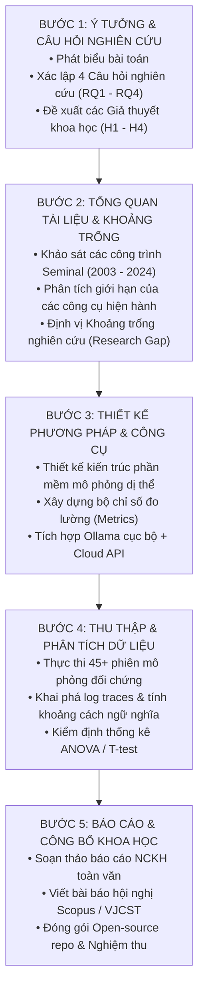

# QUY TRÌNH 5 BƯỚC THỰC HIỆN NGHIÊN CỨU KHOA HỌC CHUẨN MỰC

> **Chương 5:** Bản đồ lộ trình khoa học theo quy trình chuẩn 5 giai đoạn: từ hình thành ý tưởng, khảo sát tổng quan, thiết kế phương pháp, thực nghiệm phân tích đến báo cáo và công bố kết quả.

---

## 1. Bản đồ Tổng quan Quy trình 5 Bước NCKH

---

## 2. Bước 1: Ý tưởng & Xác định Câu hỏi Nghiên cứu (Research Questions & Hypotheses)

### 2.1. Phát biểu Vấn đề (Problem Statement)
Trong các mạng xã hội hiện đại, sự xuất hiện của các bot sử dụng LLMs tự hành có khả năng tương tác tự nhiên như con người đang làm thay đổi căn bản động thái thông tin. Tuy nhiên, cộng đồng khoa học hiện còn thiếu các công cụ thực nghiệm mở cho phép quan sát đồng thời: (1) Cấu trúc đồ thị mạng phức hợp, (2) Sự suy giảm và biến dạng ngữ nghĩa qua nhiều bước nhảy, và (3) Hiệu quả của các chiến lược can thiệp trong một hệ sinh thái AI dị thể (kết hợp mô hình mã nguồn mở cục bộ và mô hình thương mại đám mây).

### 2.2. Hệ thống Câu hỏi Nghiên cứu (Research Questions - RQs)
- **RQ1 (Về Biến dạng Ngữ nghĩa):** Quá trình lan truyền thông tin qua một chuỗi các tác tử LLMs gây ra sự biến dạng ngữ nghĩa (semantic drift) và tích tụ ảo giác như thế nào theo chiều dài bước nhảy (hop distance) và tham số nhiệt độ ($\tau$)?
- **RQ2 (Về Cấu trúc Mạng):** Các cấu trúc mạng khác nhau (Random, Small-World, Scale-Free, Modular) khuếch đại hoặc kiềm chế tốc độ lan truyền và sự hình thành buồng vang thông tin (echo chambers) như thế nào?
- **RQ3 (Về Tính Dị thể Cục bộ - Đám mây):** Việc tích hợp các mô hình Cloud lớn (GPT-4o/Gemini) đóng vai trò "nút trục" trong một mạng lưới đa số là mô hình cục bộ Ollama (Llama 3/Qwen 2.5) có giúp ổn định độ chính xác của luồng thông tin và hạn chế suy thoái tri thức hay không?
- **RQ4 (Về Chiến lược Phản biện Can thiệp):** Chiến lược định vị các tác tử Fact-Checker tại vị trí nào trong đồ thị (Ngẫu nhiên, Nút trục - High Degree, hay Cầu nối liên cụm - High Betweenness) đạt hiệu quả tối ưu nhất trong việc dập tắt tin giả với tỷ lệ nút can thiệp tối thiểu?

### 2.3. Các Giả thuyết Khoa học (Hypotheses - Hs)
- **$H_1$:** Khoảng cách ngữ nghĩa cosine giữa thông điệp tại bước $t$ và thông điệp gốc tăng theo hàm logarit hoặc tuyến tính với số bước nhảy; nhiệt độ suy luận $\tau \ge 0.7$ đẩy nhanh tốc độ đột biến thông tin có ý nghĩa thống kê ($p < 0.01$).
- **$H_2$:** Mạng Scale-Free (BA) có tốc độ bùng phát tin tức ($R_0$) nhanh gấp ít nhất 2 lần so với mạng Random (ER), nhưng cũng nhạy cảm nhất với các chiến lược kiểm soát tập trung tại các nút Hubs.
- **$H_3$:** Việc bố trí chỉ 10-15% mô hình Cloud tại các vị trí có độ trung tâm cao sẽ giúp giảm tỷ lệ trôi dạt ngữ nghĩa của toàn mạng Ollama xuống hơn 40%, đóng vai trò là "mỏ neo nhận thức" (epistemic anchors).
- **$H_4$:** Chiến lược đặt Fact-Checker tại các nút Cầu nối (High Betweenness Centrality) sẽ ngăn chặn sự lây lan tin giả giữa các buồng vang thông tin hiệu quả hơn đáng kể so với việc đặt ngẫu nhiên cùng tỷ lệ ($p < 0.05$).

---

## 3. Bước 2: Tổng quan Tài liệu & Xác định Khoảng trống Nghiên cứu (Literature Review & Research Gap)

### 3.1. Các Trụ cột Công trình Tiền đề

| Trụ cột | Các công trình then chốt | Đóng góp đã có | Giới hạn chưa giải quyết được |
|:---|:---|:---|:---|
| **Generative Multi-Agent** | Park et al. (Stanford, 2023); Wang et al. (2023) | Chứng minh các tác tử LLMs có thể sinh hoạt, giao tiếp và lan truyền tin đồn trong thị trấn ảo Smallville. | Mạng tương tác mang tính ngẫu nhiên, tự do; không kiểm soát trên các mô hình topo mạng chuẩn hóa (ER, WS, BA); chi phí API cực lớn, khó tái lập. |
| **Network Diffusion Theory** | Kempe et al. (2003); Barabási & Albert (1999); Watts & Strogatz (1998) | Xây dựng lý thuyết toán học vững chắc cho bài toán tối đa hóa ảnh hưởng (Influence Maximization) và các mô hình ICM/LTM. | Các nút mạng chỉ mang giá trị trạng thái nhị phân (0/1), không mô tả được sự biến đổi ngữ nghĩa tinh vi bằng ngôn ngữ tự nhiên. |
| **Misinformation & Social Science** | Vosoughi et al. (Science, 2018); Pennycook & Rand (2021) | Chứng minh trên dữ liệu Twitter thực tế rằng tin giả lan truyền nhanh, sâu và rộng hơn tin thật do yếu tố cảm xúc giật gân. | Nghiên cứu hồi cứu trên dữ liệu con người; không thể chủ động thử nghiệm các kịch bản can thiệp có kiểm soát sâu biến số. |
| **LLM Semantic Degradation** | Pan et al. (2023); Bubeck et al. (2023) | Phát hiện hiện tượng "Model Collapse" và sự suy thoái ngữ nghĩa khi dữ liệu do AI sinh ra được tái sử dụng qua nhiều thế hệ. | Chỉ khảo sát trên chuỗi xử lý đơn lẻ (1-to-1 pipeline), chưa đặt vào bài toán mạng lưới xã hội đa tác tử tương tác chéo. |

### 3.2. Khoảng trống Nghiên cứu Được Định vị (Identified Research Gap)
Hiện **chưa tồn tại một nền tảng thực nghiệm khoa học mở** đáp ứng đồng thời 3 tiêu chí:
1. Cho phép cấu hình linh hoạt các **topo mạng phức hợp chuẩn mực** kết hợp với các **tác tử LLM nhận thức đa tầng**.
2. Hiện thực hóa kiến trúc **dị thể (Heterogeneous)**: Ghép nối mượt mà giữa máy chủ LLM mã nguồn mở cục bộ (Ollama) nhằm tối ưu chi phí và các API mô hình đám mây cao cấp.
3. Tích hợp sẵn bộ công cụ đo lường tự động cả **Động học mạng (Topology Dynamics)** lẫn **Độ biến dạng ngữ nghĩa (Semantic Drift & Fidelity)**.

---

## 4. Bước 3: Thiết kế Phương pháp & Kiến trúc Công cụ (Methodology & System Design)

### 4.1. Thiết kế Hệ thống Thực nghiệm
- Xây dựng công cụ phần mềm với tên gọi: **`MAS-Diffusion-Lab`**.
- Hệ thống hỗ trợ lập trình bằng Python, quản lý đồ thị bằng `NetworkX`, điều phối tương tác bất đồng bộ (Asynchronous event-driven dispatching) để các tác tử gọi song song tới Ollama và Cloud APIs.

### 4.2. Chuẩn hóa Quy trình Thực nghiệm (Protocol Standardization)
1. **Khởi tạo Đồ thị:** Sinh cấu trúc mạng theo đúng tham số định sẵn ($N, p, k, \beta, m$).
2. **Gán Persona & Model:** Cấu hình System Prompt cho từng nút, gán mô hình tương ứng (Ollama hoặc Cloud).
3. **Tiêm Thông điệp Nguồn (Seed Injection):** Chọn ngẫu nhiên hoặc chỉ định nút $v_0$ tiếp nhận thông điệp $M_0$.
4. **Vòng lặp Mô phỏng (Simulation Epoch / Hop):**
   - Ở mỗi chu kỳ, các tác tử đã nhận tin quyết định: chia sẻ tiếp, phản biện, chỉnh sửa hay giữ im lặng.
   - Các thông điệp được định tuyến qua các cạnh của đồ thị đến hàng xóm.
5. **Ghi vết (Tracing & Telemetry):** Tự động ghi lại toàn bộ prompt, câu trả lời, thời gian phản hồi, số token và vector embedding vào cơ sở dữ liệu SQLite / JSONL.

---

## 5. Bước 4: Thu thập Dữ liệu Thực nghiệm, Phân tích & Kiểm định (Data Collection & Hypothesis Verification)

### 5.1. Thu thập Dữ liệu Thực nghiệm
- Chạy toàn bộ ma trận thực nghiệm gồm **9 kịch bản $\times$ 5 lần lặp = 45 phiên mô phỏng hoàn chỉnh**.
- Với mỗi phiên mô phỏng ($N = 50$, $T = 10$), hệ thống thu thập trung bình khoảng 250 - 400 thông điệp trao đổi bằng ngôn ngữ tự nhiên.
- Tổng tập dữ liệu thực nghiệm ước tính đạt trên **15,000 lượt tương tác đa tác tử**, tạo thành một kho dữ liệu kiểm chuẩn giá trị cao.

### 5.2. Phân tích Dữ liệu và Kiểm định Thống kê
1. **Phân tích Động học:** Vẽ đồ thị phân bố tỷ lệ thẩm thấu $R(t)$, đường cong lây nhiễm, độ sâu tầng thác theo thời gian.
2. **Phân tích Ngữ nghĩa:** Biểu diễn sự trôi dạt ngữ nghĩa bằng biểu đồ nhiệt (Heatmap) ma trận tương đồng Cosine giữa các thế hệ thông điệp; chiếu không gian vector bằng kỹ thuật UMAP / t-SNE để quan sát sự phân cụm quan điểm.
3. **Kiểm định Thống kê:**
   - Thực hiện kiểm định **Two-way ANOVA** để đánh giá tác động đồng thời của Cấu trúc mạng ($IV_1$) và Loại thông điệp ($IV_4$) lên Tốc độ lan truyền ($R_t$).
   - Sử dụng kiểm định **Independent Samples T-test** để so sánh hiệu quả ngăn chặn tin giả giữa chiến lược đặt Fact-Checker ở Hubs so với Bridges.

---

## 6. Bước 5: Báo cáo Khoa học, Đóng gói Công cụ & Công bố Kết quả (Reporting & Dissemination)

### 6.1. Hồ sơ Sản phẩm Đóng gói
- **Báo cáo Tổng kết Đề tài:** Soạn thảo theo mẫu quy định của Bộ Giáo dục & Đào tạo / Nhà trường (dự kiến 80-120 trang, bao gồm đầy đủ cơ sở lý thuyết, kết quả thực nghiệm, biểu đồ và mã nguồn).
- **Kho lưu trữ Mã nguồn Mở (GitHub Repository):**
  - Mã nguồn sạch, tài liệu hướng dẫn cài đặt `README.md`, file cấu hình môi trường `requirements.txt` hoặc `Docker Compose`.
  - Giấy phép mã nguồn mở MIT License hoặc Apache 2.0.
- **Tập Dữ liệu Thực nghiệm Kiểm chuẩn (Benchmark Dataset):** Đóng gói bộ dữ liệu trace lan truyền và embeddings đưa lên Hugging Face Hub.

### 6.2. Kế hoạch Công bố Khoa học (Publication Targets)
1. **Bài báo Hội nghị Khoa học Quốc gia / Quốc tế:**
   - Ưu tiên Hội nghị Quốc gia về Nghiên cứu cơ bản và ứng dụng Công nghệ thông tin (FAIR).
   - Hội thảo Quốc tế về Khoa học Máy tính và Mạng tri thức (RIVF, KSE, SOICT) - Kỷ yếu xuất bản bởi IEEE / Springer, được đánh chỉ mục trong Scopus.
2. **Bài báo Tạp chí Khoa học:**
   - Chuyên san Các công trình Nghiên cứu, Phát triển và Ứng dụng CNTT-TT (Tạp chí VJCST - Bộ Thông tin & Truyền thông).
   - Tạp chí Khoa học & Công nghệ Đại học Quốc gia / Đại học Bách khoa.
3. **Giải thưởng NCKH Sinh viên:**
   - Tham gia Giải thưởng "Sinh viên Nghiên cứu Khoa học" cấp Trường, cấp Thành phố (Eurêka) hoặc Giải thưởng NCKH Sinh viên cấp Bộ.
