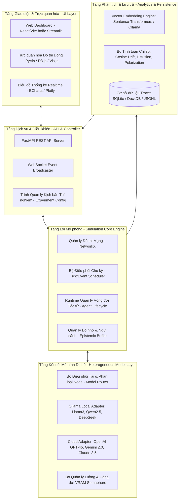
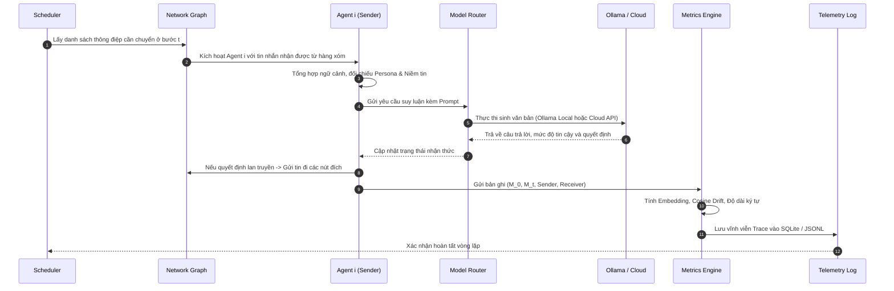
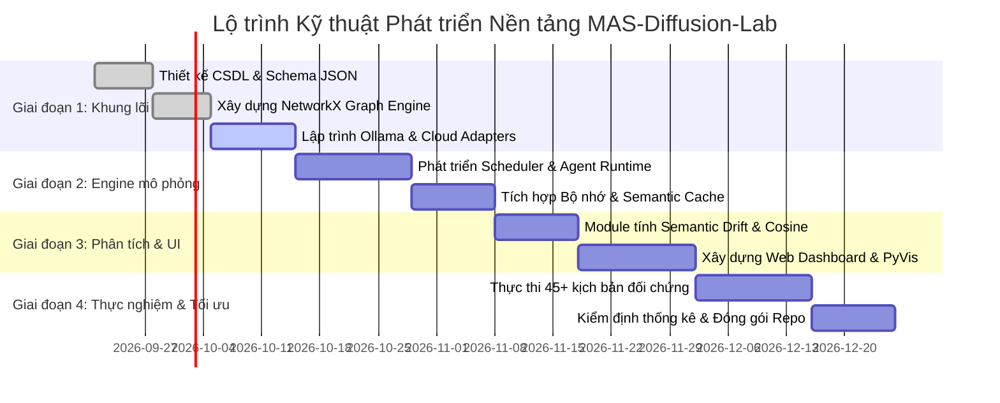

# KIẾN TRÚC CÔNG CỤ VÀ KẾ HOẠCH TRIỂN KHAI KỸ THUẬT

> **Chương 6:** Thiết kế kiến trúc phần mềm, cơ chế tích hợp mô hình cục bộ Ollama và Cloud AI, quy trình điều phối bất đồng bộ và kế hoạch phát triển công cụ `MAS-Diffusion-Lab`.

---

## 1. Kiến trúc Hệ thống Tổng thể (System Architecture)

Công cụ mô phỏng được thiết kế theo kiến trúc **5 tầng hướng module (Modular 5-Layer Architecture)**, đảm bảo tính mở rộng cao, khả năng cắm/rút linh hoạt giữa các nhà cung cấp LLM, và khả năng tái lập thực nghiệm dễ dàng:



---

## 2. Chi tiết Tích hợp Mô hình Cục bộ (Ollama) và Mô hình Đám mây (Cloud)

### 2.1. Cấu hình Cụm Mô hình Cục bộ (Ollama Local Edge)
- **Địa chỉ kết nối:** `http://localhost:11434/api/generate` hoặc qua thư viện `ollama-python`.
- **Danh sách mô hình khuyến nghị trên môi trường cục bộ:**
  1. `llama3:8b-instruct-q4_K_M`: Đại diện cho mô hình tổng quát mạnh mẽ, cân bằng nhận thức tốt.
  2. `qwen2.5:7b-instruct`: Khả năng suy luận logic và tuân thủ định dạng JSON/structured prompt rất cao.
  3. `deepseek-r1:8b`: Mô hình chuyên sâu về tư duy phản biện (reasoning/chain-of-thought), lý tưởng cho vai trò **Fact-Checker**.
  4. `mistral:7b-instruct-v0.3`: Xử lý sắc thái ngữ nghĩa linh hoạt.
- **Cơ chế Điều tiết Tài nguyên Phần cứng (VRAM / Concurrency Guard):**
  Do máy trạm thực nghiệm có giới hạn về VRAM card đồ họa (GPU), hệ thống triển khai bộ điều khiển `asyncio.Semaphore(concurrency_limit)` (ví dụ: tối đa 2-4 tác tử gọi mô hình cục bộ song song) để tránh lỗi tràn bộ nhớ (CUDA Out-of-Memory).

### 2.2. Tích hợp Mô hình Đám mây (Cloud Tier)
- **Mô hình mục tiêu:**
  - `gpt-4o-mini` / `gpt-4o` (OpenAI SDK)
  - `gemini-1.5-flash` / `gemini-2.0-flash` (Google GenAI SDK)
  - `claude-3-5-sonnet` (Anthropic SDK)
- **Vai trò trong mạng lưới:**
  - Được gán cho các nút có bậc liên kết cao (Hubs), nút cầu nối (Bridges) hoặc nút thẩm định độc lập (LLM-as-a-Judge).
  - Đóng vai trò làm mốc đối chứng chất lượng cao để đánh giá sự khác biệt hành vi giữa các mô hình mở quy mô 7B-8B và các mô hình thương mại hàng đầu thế giới.

---

## 3. Luồng Thực thi của Một Bước Mô phỏng (Hop Cycle Sequence)



---

## 4. Đặc tả Cấu trúc Dữ liệu Thông điệp (Message Envelope Schema)

Mỗi thông điệp lưu thông trong mạng lưới được chuẩn hóa theo định dạng JSON có cấu trúc:

```json
{
  "simulation_id": "SIM_2026_EXP04_RUN01",
  "hop_count": 3,
  "timestamp": 1774108800.125,
  "origin_message": {
    "claim_id": "CLAIM_MED_01",
    "text": "Tổ chức Y tế khẳng định rằng việc tập thể dục 30 phút mỗi ngày giúp giảm 40% nguy cơ bệnh tim mạch.",
    "veracity": "GROUND_TRUTH"
  },
  "current_message": {
    "sender_id": "agent_07",
    "sender_persona": "GULLIBLE_SPREADER",
    "sender_model": "ollama:llama3:8b",
    "receiver_id": "agent_12",
    "text": "Nghe nói các chuyên gia bảo chỉ cần chạy bộ là hết sạch nguy cơ đột quỵ luôn, mọi người nên chia sẻ ngay!",
    "sentiment": "EXCITED",
    "subjective_confidence": 0.95
  },
  "metrics": {
    "semantic_cosine_distance": 0.284,
    "distortion_detected": true,
    "hallucinated_entities": ["hết sạch nguy cơ đột quỵ"]
  }
}
```

---

## 5. Kế hoạch Triển khai Kỹ thuật & Lộ trình Thời gian (Development Roadmap)

Dự án được phân chia thành 4 giai đoạn kỹ thuật (Sprints) rõ ràng:



### 5.1. Phân kỳ Công việc Chi tiết

1. **Sprint 1: Xây dựng Nền tảng và Adapter Kết nối (Tuần 1 - 3)**
   - Khởi tạo cấu trúc dự án Python hiện đại sử dụng `poetry` hoặc `pip`.
   - Viết các adapter bất đồng bộ kết nối Ollama (`/api/generate`) và Cloud APIs (OpenAI, Google Gemini, Anthropic).
   - Viết test suite kiểm tra độ trễ mạng và xử lý lỗi rớt mạng/rate limit.
2. **Sprint 2: Lõi Mô phỏng và Đồ thị Mạng (Tuần 4 - 6)**
   - Hiện thực hóa module sinh đồ thị `topology_generator.py` với các thuật toán ER, WS, BA, SBM.
   - Xây dựng Agent State Machine (Perceive -> Deliberate -> Act).
   - Tích hợp bộ đệm Context Window và chống tràn bộ nhớ.
3. **Sprint 3: Engine Đo lường và Giao diện Trực quan (Tuần 7 - 9)**
   - Tích hợp mô hình Text Embedding tính khoảng cách Cosine theo thời gian thực.
   - Xây dựng Web Dashboard tương tác (hiển thị đồ thị mạng với các node đổi màu theo trạng thái tin tưởng/hoài nghi).
   - Xuất dữ liệu telemetry ra các định dạng chuẩn (CSV, JSONL, SQLite).
4. **Sprint 4: Chạy Thực nghiệm Kiểm định & Tinh chỉnh (Tuần 10 - 12)**
   - Tiến hành chạy tự động hóa toàn bộ 45 phiên thực nghiệm đối chứng.
   - Xuất các biểu đồ thống kê, tính $p$-value và biên soạn báo cáo kỹ thuật.
