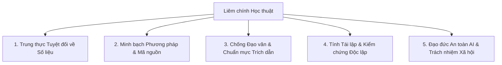
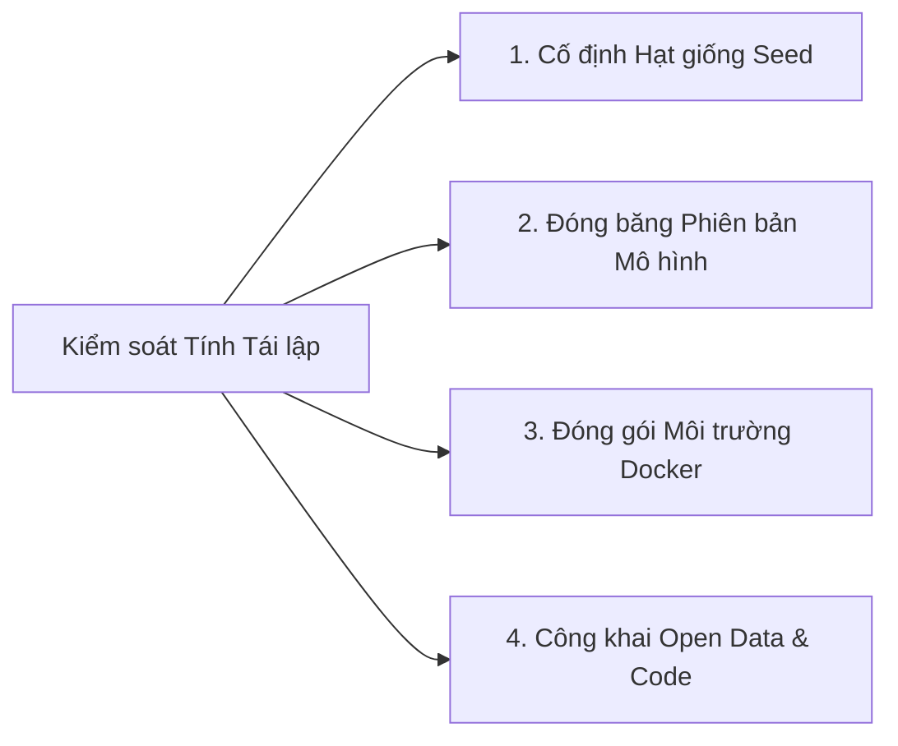

# LIÊM CHÍNH HỌC THUẬT, TÍNH TÁI LẬP VÀ ĐẠO ĐỨC AI

> **Chương 7:** Các nguyên tắc liêm chính học thuật, tiêu chuẩn tái lập thực nghiệm (Reproducibility), khung đạo đức trong nghiên cứu an toàn AI và chính sách minh bạch thông tin.

---

## 1. Nguyên tắc Liêm chính Học thuật (Academic Integrity Principles)

Liêm chính học thuật là nền tảng sống còn của mọi công trình khoa học. Đề tài cam kết tuân thủ nghiêm ngặt các chuẩn mực quốc tế theo khuyến nghị của **Ủy ban Đạo đức Xuất bản Quốc tế (Committee on Publication Ethics - COPE)** và **Tuyên bố Singapore về Liêm chính trong Nghiên cứu (Singapore Statement on Research Integrity)**:

### 1.1. Trung thực Tuyệt đối trong Đo lường và Dữ liệu Thực nghiệm
- **Nghiêm cấm Ngụy tạo Số liệu (Data Fabrication):** Tuyệt đối không tự ý "vẽ" ra các số liệu đo lường về tỷ lệ lan truyền, điểm cosine drift hay phân cực mà không thông qua quá trình chạy mô phỏng thực tế.
- **Nghiêm cấm Cắt xén, Xuyên tạc Kết quả (Data Falsification & Cherry-picking):**
  - Mọi kết quả dù phù hợp hay mâu thuẫn với giả thuyết ban đầu ($H_1 - H_4$) đều phải được ghi nhận và phân tích khách quan.
  - Các trường hợp ngoại lệ (outliers), mô hình cục bộ sinh ảo giác bất thường hoặc lỗi suy luận đều là dữ liệu khoa học quý giá phản ánh đúng bản chất của công nghệ LLM hiện nay.
- **Lưu trữ Bằng chứng Gốc (Raw Trace Provenance):** Toàn bộ nhật ký mô phỏng (prompts, raw text output, timestamps, số token tiêu thụ, seed đồ thị) được tự động lưu vết vĩnh viễn dưới định dạng chuẩn JSONL/SQLite để sẵn sàng phục vụ công tác thanh tra, hậu kiểm của Hội đồng Khoa học.

### 1.2. Chống Đạo văn và Quy chuẩn Trích dẫn (Anti-Plagiarism & Proper Attribution)
- **Tôn trọng Quyền Tác giả:** Mọi lý thuyết nền tảng (Mô hình Tứ giác Pasteur của Stokes, Mô hình Thác thông tin của Kempe/Bikhchandani, Kiến trúc Tác tử của Park et al.,...) đều phải được trích dẫn nguồn gốc xuất bản rõ ràng.
- **Quy chuẩn Định dạng Trích dẫn:** Áp dụng thống nhất định dạng trích dẫn chuẩn **IEEE** (đối với lĩnh vực Kỹ thuật / CNTT) hoặc **APA 7th** (đối với Khoa học Xã hội Tính toán).
- **Ghi nhận Đóng góp của Công cụ Mã nguồn Mở:** Nêu rõ sự kế thừa từ các thư viện cộng đồng như `NetworkX`, `Ollama`, `Sentence-Transformers`, `FastAPI`, `PyVis`.

---

## 2. Tiêu chuẩn Đảm bảo Tính Tái lập (Reproducibility & Replicability)

Một trong những thách thức lớn nhất của nghiên cứu dựa trên LLM là tính xác suất và ngẫu nhiên (stochastic nature) của quá trình giải mã (decoding). Để đảm bảo các nhà khoa học khác trên thế giới có thể **tái lập hoàn toàn kết quả nghiên cứu**, đề tài thiết lập quy trình kiểm soát nghiêm ngặt:

### 2.1. Kiểm soát Tính Ngẫu nhiên (Randomness Control)
1. **Cố định Hạt giống (Seed) Đồ thị:**
   Mọi thuật toán sinh cấu trúc mạng (ER, WS, BA, SBM) trong `NetworkX` đều được gán `seed = 42` (hoặc seed danh định của từng lần lặp) để tái lập chính xác 100% các nút và liên kết.
2. **Cố định Seed của Mô hình Ngôn ngữ:**
   - Với Ollama: Truyền tham số `"seed": 42` vào payload gọi API `/api/generate`.
   - Với OpenAI API: Thiết lập tham số `"seed": 42` trong payload `chat.completions.create`.
3. **Thực nghiệm ở Nhiệt độ Tuyệt đối và Thực tế:**
   - Nhóm kiểm chứng xác định (Deterministic Baseline): Chạy thử nghiệm với nhiệt độ $\tau = 0.0$ để kiểm tra tính ổn định của luồng logic.
   - Nhóm thực nghiệm hành vi (Behavioral Testing): Chạy với $\tau = 0.7$, thực hiện tối thiểu $K = 5$ lần lặp độc lập và báo cáo kết quả kèm sai số chuẩn (Mean $\pm$ Standard Error).

### 2.2. Minh bạch Phiên bản và Thông số Mô hình (Model Provenance)
Mọi báo cáo kết quả đều phải chỉ rõ:
- **Tên mô hình chính xác và Định dạng lượng tử:** Ví dụ `llama3:8b-instruct-q4_K_M` (kích thước hash cụ thể của Ollama manifest), không ghi chung chung là "Llama 3".
- **Phiên bản API Cloud:** Ví dụ `gpt-4o-2024-08-06`, `gemini-1.5-flash-002`.
- **Siêu tham số đầy đủ:** `temperature`, `top_p`, `max_tokens`, `presence_penalty`, `frequency_penalty`.
- **System Prompt nguyên bản:** Công khai 100% nội dung prompt chỉ đạo vai trò (persona directives) trong phụ lục kỹ thuật.

### 2.3. Đóng gói Môi trường Tự động (Containerized Environment)
- Toàn bộ mã nguồn được đóng gói đi kèm file cấu hình môi trường chuẩn:
  - `Dockerfile` và `docker-compose.yml` định nghĩa sẵn môi trường Python 3.11, cài đặt đầy đủ các thư viện và cấu hình port kết nối tới Ollama.
  - File `pyproject.toml` khóa chặt phiên bản của từng package phụ thuộc (pinned dependencies).

---

## 3. Khung Đạo đức Nghiên cứu AI và An toàn Thông tin (AI Safety & Ethics)

Do đề tài nghiên cứu về sự lan truyền của tin tức, tin đồn và thông tin sai lệch (Misinformation/Disinformation), việc tuân thủ các quy chuẩn an toàn là bắt buộc nhằm tránh các tác động tiêu cực ngoài dự kiến:

### 3.1. Nguyên tắc "Hộp cát Khép kín" (Sandboxed Air-Gap Principle)
- **Tuyệt đối không kết nối với Mạng xã hội Đời thực:** Hệ thống mô phỏng là một môi trường phần mềm đóng cục bộ (Local Closed Sandbox). Các tác tử nhân tạo chỉ trao đổi nội bộ trong đồ thị ảo. Tuyệt đối không tích hợp API để tự động đăng tải (post/tweet) nội dung ra Facebook, X/Twitter, Telegram hay bất kỳ nền tảng thực tế nào.
- **Dữ liệu Thông điệp Tổng hợp An toàn (Synthetic & Safe Benchmarks):**
  - Các kịch bản thử nghiệm về tin giả chỉ sử dụng các chủ đề khoa học giả tưởng vô hại (ví dụ: *"Các nhà khoa học phát hiện loài chim cánh cụt biết bay tại Nam Cực"*) hoặc các kịch bản y tế thông thường đã được cộng đồng nghiên cứu NLP chuẩn hóa.
  - Tuyệt đối không tạo ra các thông tin giả liên quan đến kích động bạo lực, xung đột vũ trang, thù ghét sắc tộc, xúc phạm danh dự cá nhân hoặc hướng dẫn hành vi vi phạm pháp luật.

### 3.2. Bảo mật Khóa API và Dữ liệu Nhạy cảm (Secrets Management)
- Khóa bảo mật (OpenAI API Key, Gemini API Key, Anthropic Key) phải được lưu trữ trong tệp cấu hình môi trường `.env`.
- Tệp `.env` được đưa vào `.gitignore` ngay từ đầu dự án, tuyệt đối không được push lên các kho lưu trữ công khai như GitHub.

### 3.3. Tuyên bố Minh bạch về việc Sử dụng Công cụ AI Trợ lực (AI Usage Disclosure)
Tuân thủ tuyên bố chuẩn mực của các hiệp hội xuất bản khoa học hàng đầu:
- **Tuyên bố Minh bạch (Disclosure):** Tác giả công khai việc sử dụng các trợ lý lập trình AI (như Antigravity IDE, Claude, Gemini) để hỗ trợ tra cứu tài liệu, rà soát lỗi cú pháp mã nguồn và định dạng tài liệu kỹ thuật.
- **Trách nhiệm của Tác giả (Human Accountability):** Toàn bộ ý tưởng khoa học, thiết kế phương pháp luận, phân tích số liệu và các kết luận nghiên cứu đều do nhóm tác giả thực hiện và chịu trách nhiệm học thuật cao nhất.

---

## 4. Danh mục Tài liệu Tham khảo Khoa học Tiêu biểu (Selected Seminal References)

1. **Stokes, D. E.** (1997). *Pasteur's quadrant: Basic science and technological innovation*. Brookings Institution Press.
2. **Park, J. S., O'Brien, J. C., Cai, C. J., Morris, M. R., Liang, P., & Bernstein, M. S.** (2023). *Generative agents: Interactive simulacra of human behavior*. In Proceedings of the 36th Annual ACM Symposium on User Interface Software and Technology (UIST '23), pp. 1–22.
3. **Kempe, D., Kleinberg, J., & Tardos, É.** (2003). *Maximizing the spread of influence through a social network*. In Proceedings of the ninth ACM SIGKDD international conference on Knowledge discovery and data mining (KDD '03), pp. 137–146.
4. **Watts, D. J., & Strogatz, S. H.** (1998). *Collective dynamics of 'small-world' networks*. Nature, 393(6684), 440–442.
5. **Barabási, A. L., & Albert, R.** (1999). *Emergence of scaling in random networks*. Science, 286(5439), 509–512.
6. **Vosoughi, S., Roy, D., & Aral, S.** (2018). *The spread of true and false news online*. Science, 359(6380), 1146–1151.
7. **Bikhchandani, S., Hirshleifer, D., & Welch, I.** (1992). *A theory of fads, fashion, custom, and cultural change as informational cascades*. Journal of Political Economy, 100(5), 992–1026.
8. **Wang, L., Ma, C., Feng, X., Zhang, Z., Yang, H., Zhang, J., ... & Ji, H.** (2024). *A survey on large language model based autonomous agents*. Frontiers of Computer Science, 18(6), 186345.
9. **Pan, X., Chen, M., & Zou, J.** (2023). *On the risk of information cascades and semantic drift in multi-agent generative systems*. arXiv preprint arXiv:2310.08984.
