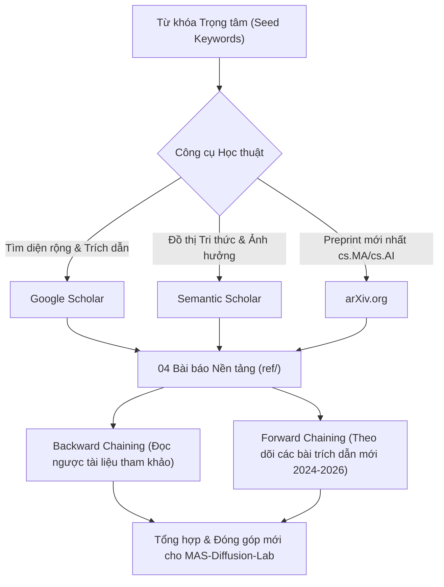
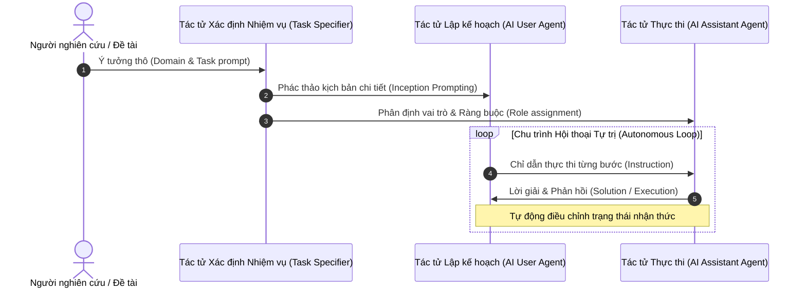
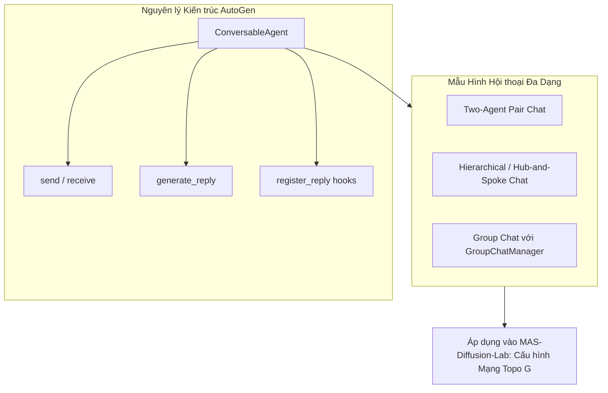
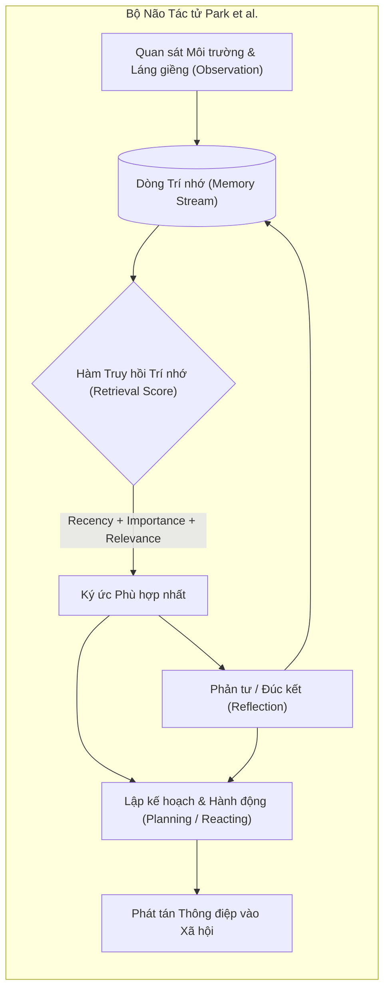
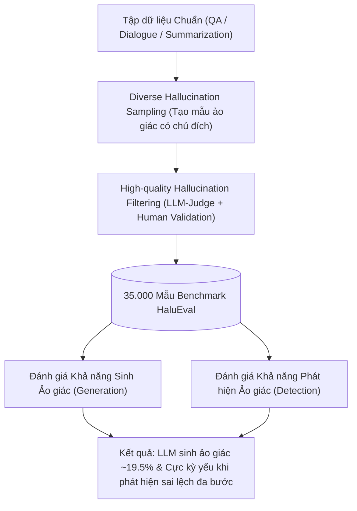

# CHƯƠNG 8: TỔNG QUAN TÀI LIỆU KINH ĐIỂN VÀ PHƯƠNG PHÁP TRA CỨU HỌC THUẬT

> **Tài liệu học thuật trọng tâm:** Báo cáo phân tích chuyên sâu 04 công trình nghiên cứu kinh điển đặt nền móng cho Đề tài NCKH 2026: *"Nghiên cứu, phát triển công cụ mô phỏng và đánh giá thực nghiệm quá trình lan truyền thông tin trong mạng lưới đa tác tử trên các mô hình ngôn ngữ lớn (LLMs)"*.

---

## 1. Phương pháp luận Tra cứu Học thuật & Mở rộng Mạng lưới Trích dẫn

Để xây dựng một công trình NCKH đạt chuẩn quốc tế, nhóm nghiên cứu cần làm chủ kỹ năng khai phá dữ liệu học thuật từ 3 cơ sở dữ liệu mở hàng đầu: **Google Scholar**, **Semantic Scholar**, và **arXiv**.



### 1.1. Khung Từ khóa Trọng tâm (Core Keyword Matrix) & Chuỗi Truy vấn Boolean

Sinh viên sử dụng các chuỗi truy vấn (Boolean Search Strings) đã tối ưu dưới đây để tìm kiếm chính xác các bài báo liên quan mật thiết:

| Trục nghiên cứu | Từ khóa trọng tâm | Chuỗi truy vấn mẫu (Copy-paste vào Scholar/Semantic Scholar) |
|:---|:---|:---|
| **Đa tác tử LLM** | `Multi-Agent LLMs` | `("Multi-Agent" OR "Communicative Agents") AND ("LLM" OR "Large Language Models") AND ("collaboration" OR "cooperation")` |
| **Lan truyền Thông tin** | `Information Propagation in LLM Networks` | `("information propagation" OR "information diffusion" OR "rumor spreading") AND ("LLM" OR "Generative Agents") AND ("network" OR "graph")` |
| **Trôi dạt Ngữ nghĩa** | `Semantic Drift` | `("semantic drift" OR "information distortion" OR "telephone game") AND ("LLMs" OR "multi-turn" OR "multi-hop")` |
| **Đồng thuận & Buồng vang** | `Multi-Agent Consensus` | `("multi-agent consensus" OR "opinion dynamics" OR "echo chamber" OR "belief polarization") AND ("LLM" OR "generative agents")` |
| **Ảo giác Chuỗi suy luận** | `Hallucination in Multi-Hop Reasoning` | `("hallucination compounding" OR "error propagation") AND ("multi-hop reasoning" OR "multi-agent") AND "LLM"` |

### 1.2. Kỹ thuật Khai thác Chuyên sâu từng Nền tảng

1. **Google Scholar (`scholar.google.com`):**
   - **Lọc theo năm:** Đặt khoảng tùy chỉnh `2023 - 2026` để nắm bắt các nghiên cứu đương đại về LLM agents.
   - **Forward Snowballing:** Nhấp vào mục `Cited by ...` (Được trích dẫn bởi...) của 4 bài báo kinh điển để tìm các hướng phát triển mới nhất kế thừa từ chúng.
   - **Tạo thông báo tự động (Alerts):** Cài đặt Alert với từ khóa `"information diffusion" AND "LLM agent"` để nhận email khi có bài báo mới được chỉ mục.

2. **Semantic Scholar (`semanticscholar.org`):**
   - **Highly Influential Citations:** Lọc các bài báo trích dẫn mà thực sự kế thừa phương pháp luận hoặc phát triển trực tiếp kết quả (không chỉ trích dẫn hình thức).
   - **Semantic Reader & Citation Graph:** Khai thác biểu đồ liên kết bài báo để tìm các công trình đồng tác giả hoặc cùng chủ đề giao thoa giữa Khoa học Mạng (Network Science) và Xử lý Ngôn ngữ Tự nhiên (NLP).

3. **arXiv (`arxiv.org`):**
   - Theo dõi các chuyên mục chính: `cs.MA` (Multiagent Systems), `cs.AI` (Artificial Intelligence), `cs.CL` (Computation and Language), `cs.SI` (Social and Information Networks).
   - Truy xuất nhanh mã định danh arXiv ID để lấy tệp BibTeX chuẩn xác không lỗi font hoặc thiếu trường.

---

## 2. Phân tích Chuyên sâu 04 Bài báo Nền tảng Bắt buộc

---

### 📄 Tài liệu 1: CAMEL — Mô hình Hội thoại Đa Tác tử Đóng vai Tự chủ

* **Tên bài báo:** *CAMEL: Communicative Agents for "Mind" Exploration of Large Language Model Society*
* **Tác giả:** Guohao Li, Hasan Abed Al Kader Hammoud, Hani Itani, Dmitrii Khizbullin, Bernard Ghanem (KAUST)
* **Kỷ yếu xuất bản:** *Advances in Neural Information Processing Systems 36 (NeurIPS 2023)*
* **Tệp tài liệu nội bộ:** [`ref/CAMEL_Multi_Agent_NeurIPS_2023.pdf`](file:///g:/Project/NCKH_2026/ref/CAMEL_Multi_Agent_NeurIPS_2023.pdf) (77 trang)

```bibtex
@inproceedings{li2023camel,
  title={CAMEL: Communicative Agents for "Mind" Exploration of Large Language Model Society},
  author={Li, Guohao and Hammoud, Hasan Abed Al Kader and Itani, Hani and Khizbullin, Dmitrii and Ghanem, Bernard},
  booktitle={Thirty-seventh Conference on Neural Information Processing Systems (NeurIPS)},
  year={2023}
}
```



#### A. Động lực & Bài toán Nghiên cứu
Trước khi có CAMEL, tương tác với LLM chủ yếu ở dạng **Human-in-the-loop** (con người liên tục đặt câu hỏi và gõ gợi ý). Hạn chế lớn là tốn nhân lực, không thể mở rộng để nghiên cứu hành vi xã hội quy mô lớn và khó quan sát được cách thức các LLM tự suy luận khi hợp tác với nhau. CAMEL đặt vấn đề: *Làm thế nào để hai hay nhiều tác tử LLM có thể tự chủ hoàn toàn trong việc giao tiếp, giải quyết nhiệm vụ phức tạp mà không bị rơi vào vòng lặp vô tận hoặc mất kiểm soát hội thoại?*

#### B. Phương pháp luận & Đóng góp Cốt lõi
1. **Inception Prompting (Kỹ thuật mớm vai trò):**
   - Thiết kế prompt đặc biệt phân định ranh giới nghiêm ngặt: Một tác tử làm **AI User** (người giao nhiệm vụ, lập kế hoạch), một tác tử làm **AI Assistant** (người thực hiện).
   - Ràng buộc thép: *"Never forget you are <ROLE>... Never flip roles! Never instruct me!"* nhằm ngăn chặn triệt để hiện tượng **Lật vai (Role-flipping)**.
2. **Cơ chế Tự động Hóa Nhiệm vụ (Task Specifier Agent):**
   - Tiếp nhận ý tưởng sơ khai từ con người và tự động đặc tả hóa thành nhiệm vụ chi tiết trước khi hai tác tử bắt đầu thảo luận.
3. **Bộ dữ liệu Tổng hợp Quy mô Lớn:**
   - Thu thập hơn 20.000 cuộc hội thoại giải quyết vấn đề (AI Society Dataset, AI Code Dataset) minh chứng khả năng hợp tác đa tác tử.

#### C. Phát hiện Thực nghiệm Đột phá & Hiện tượng Bất thường
- **Role-Flipping & Role-Collapse:** Khi ngữ cảnh dài ra, các tác tử có xu hướng quên vai ban đầu và bắt đầu tranh giành quyền chỉ đạo.
- **Vòng lặp Vô tận (Repetitive / Infinite Loops):** Hai tác tử lịch sự cảm ơn nhau liên tục (*"Thank you! Is there anything else?" - "No, thank you, great job!"*) mà không chịu kết thúc nhiệm vụ.
- **Ảo giác Hành động (Action Hallucination):** Tác tử khẳng định đã kiểm tra tệp tin hoặc đã chạy mã nguồn thực tế trong khi môi trường chưa từng kết nối môi trường thực thi.

#### D. Ý nghĩa & Ứng dụng Trực tiếp cho Đề tài NCKH 2026 (`MAS-Diffusion-Lab`)
- **Thiết kế System Prompt chuẩn hóa:** Bộ lọc Inception Prompting của CAMEL là kim chỉ nam để viết Persona cho các tác tử trong mạng (`src/core/agent.py`), đảm bảo tác tử giữ vững lập trường (ví dụ: Fact-checker không bị biến chất thành Spreader sau nhiều vòng thảo luận).
- **Quy tắc Dừng hội thoại (Stopping Criteria):** Cung cấp cơ chế phát hiện hội thoại bế tắc để ngắt quá trình lan truyền tin đồn nếu các nút lân cận rơi vào trạng thái bão hòa lặp lại.

---

### 📄 Tài liệu 2: AutoGen — Khung Điều phối Đa Tác tử Mở rộng

* **Tên bài báo:** *AutoGen: Enabling Next-Gen LLM Applications via Multi-Agent Conversation*
* **Tác giả:** Qingyun Wu, Gagan Bansal, Jieyu Zhang, Yiran Wu, Beibin Li, Erkang Zhu, Li Jiang, Xiaoyun Zhang, Shaokun Zhang, Jiale Liu, Ahmed Awadallah, Ryen W. White, Doug Burger, Chi Wang (Microsoft Research, Penn State, UW)
* **Xuất bản:** *Microsoft Research Technical Report / arXiv (2023)*
* **Tệp tài liệu nội bộ:** [`ref/AutoGen_Multi_Agent_2023.pdf`](file:///g:/Project/NCKH_2026/ref/AutoGen_Multi_Agent_2023.pdf) (43 trang)

```bibtex
@article{wu2023autogen,
  title={AutoGen: Enabling Next-Gen LLM Applications via Multi-Agent Conversation},
  author={Wu, Qingyun and Bansal, Gagan and Zhang, Jieyu and Wu, Yiran and Li, Beibin and Zhu, Erkang and Jiang, Li and Zhang, Xiaoyun and Zhang, Shaokun and Liu, Jiale and others},
  journal={arXiv preprint arXiv:2308.08155},
  year={2023}
}
```



#### A. Động lực & Bài toán Nghiên cứu
Các công cụ đa tác tử ban đầu (như CAMEL) bị bó hẹp trong giao tiếp 1-1 (cặp đôi cố định) và khó nhúng công cụ ngoại vi hoặc tích hợp người dùng. Microsoft Research đặt mục tiêu tạo ra một khung lập trình hội thoại (**Conversation Programming**) linh hoạt, cho phép xâu chuỗi hàng chục tác tử với các mô hình LLM khác nhau, hỗ trợ phân nhánh mạng lưới tùy ý.

#### B. Phương pháp luận & Đóng góp Cốt lõi
1. **Lớp trừu tượng `ConversableAgent`:**
   - Mọi tác tử đều chia sẻ một giao diện thống nhất: có khả năng gửi nhận tin nhắn (`send`, `receive`) và sinh câu trả lời (`generate_reply`).
   - Khả năng đăng ký hàm trả lời tùy biến (`register_reply`) giúp chèn các thuật toán can thiệp nội bộ mà không phá vỡ vòng lặp.
2. **Conversation Programming (Lập trình mẫu hình hội thoại):**
   - Hỗ trợ linh hoạt từ hội thoại cặp (Two-agent), phân cấp (Hierarchical), đến thảo luận nhóm động (**Dynamic Group Chat** điều phối bởi `GroupChatManager`).
3. **Sự kết hợp Dị thể (Model Heterogeneity):**
   - Dễ dàng gán các LLM khác nhau cho từng tác tử (ví dụ: tác tử trung tâm Hub dùng GPT-4o, tác tử ngoại vi dùng mô hình nhẹ như Llama 3 8B hoặc Qwen 2.5 3B).

#### C. Phát hiện Thực nghiệm Đột phá
- Kiến trúc đa tác tử phân chia nhiệm vụ giảm thiểu tỷ lệ lỗi suy luận so với việc bắt một LLM duy nhất tự giải quyết toàn bộ bài toán phức tạp.
- Quá trình chọn người nói tiếp theo (**Speaker Selection Strategy**) quyết định tốc độ đạt đến trạng thái đồng thuận: Chọn theo kiểu Round-Robin cho kết quả phân tán, trong khi dùng LLM-based selector dễ dẫn đến độc quyền phát ngôn của các nút có tính hướng ngoại cao.

#### D. Ý nghĩa & Ứng dụng Trực tiếp cho Đề tài NCKH 2026 (`MAS-Diffusion-Lab`)
- **Kiến trúc Engine (`src/core/engine.py` & `src/core/network.py`):** Cung cấp bài học chuẩn mực về cách thiết kế hàm `step()` và bộ định tuyến tin nhắn giữa các nút trên đồ thị mạng phức hợp $G=(V, E)$.
- **Thử nghiệm Đa mô hình Dị thể:** Cho phép nhóm mô phỏng mạng lưới kết hợp giữa mô hình cục bộ chạy trên máy trạm RTX 3050 Ti (`qwen2.5:3b`, `llama3:8b`) và mô hình đám mây qua API.

---

### 📄 Tài liệu 3: Generative Agents — Xã hội Tác tử Mô phỏng & Lan truyền Thông tin

* **Tên bài báo:** *Generative Agents: Interactive Simulacra of Human Behavior*
* **Tác giả:** Joon Sung Park, Joseph C. O'Brien, Carrie J. Cai, Meredith Ringel Morris, Percy Liang, Michael S. Bernstein (Stanford University, Google Research)
* **Kỷ yếu xuất bản:** *The 36th Annual ACM Symposium on User Interface Software and Technology (ACM UIST 2023)* — **Best Paper Award**
* **Tệp tài liệu nội bộ:** [`ref/Generative_Agents_UIST_2023.pdf`](file:///g:/Project/NCKH_2026/ref/Generative_Agents_UIST_2023.pdf) (22 trang)

```bibtex
@inproceedings{park2023generative,
  title={Generative Agents: Interactive Simulacra of Human Behavior},
  author={Park, Joon Sung and O'Brien, Joseph C and Cai, Carrie J and Morris, Meredith Ringel and Liang, Percy and Bernstein, Michael S},
  booktitle={Proceedings of the 36th Annual ACM Symposium on User Interface Software and Technology},
  pages={1--22},
  year={2023}
}
```



#### A. Động lực & Bài toán Nghiên cứu
Làm sao để tạo ra các tác tử nhân tạo có hành vi xã hội đáng tin cậy (believable human-like behavior), có khả năng ghi nhớ dài hạn, tự hình thành mối quan hệ và lan tỏa thông tin trong một thị trấn ảo 25 người (Smallville)?

#### B. Phương pháp luận & Đóng góp Cốt lõi
1. **Kiến trúc Nhận thức 3 Trụ cột:**
   - **Memory Stream (Dòng sự kiện):** Nhật ký toàn bộ trải nghiệm của tác tử theo thời gian thực.
   - **Cơ chế Truy hồi (Retrieval Function):** Kết hợp 3 trọng số toán học:
     $$\text{Score} = \alpha_{\text{recency}} \cdot \text{Recency} + \alpha_{\text{importance}} \cdot \text{Importance} + \alpha_{\text{relevance}} \cdot \text{Relevance}$$
   - **Reflection (Phản tư):** Tự sinh ra các suy nghĩ trừu tượng cấp cao từ chuỗi ký ức vụn vặt, cập nhật lại vào dòng trí nhớ.
   - **Planning (Lập kế hoạch):** Chuyển hóa mục tiêu dài hạn thành hành động chi tiết từng giờ.
2. **Thực nghiệm Lan truyền Thông tin Tự nhiên (Information Diffusion Experiments):**
   - **Kịch bản Bữa tiệc Valentine:** Gieo mầm tin tức cho 01 tác tử (Isabella Rodriguez), thông tin tự lan truyền qua các cuộc trò chuyện ngẫu nhiên đến các cư dân khác, dẫn đến việc họ tự hẹn hò và cùng đến dự tiệc.
   - **Kịch bản Bầu cử Thị trưởng:** Thông tin ứng cử viên Sam Moore tự lan tỏa và tạo ra luồng dư luận ủng hộ/phản đối trong cộng đồng.

#### C. Phát hiện Thực nghiệm Đột phá & Nguy cơ Biến dạng Ngữ nghĩa
- **Lan tỏa phi tuyến tính:** Thông tin không lan truyền theo đường thẳng mà rẽ nhánh theo mức độ thân thiết của mối quan hệ xã hội.
- **Hiện tượng Thêm thắt / Biến dạng (Embellishment):** Tác tử nghe tin đồn cấp 1, khi truyền lại cho người thứ 3 đã vô thức thêm vào các chi tiết không có thật dựa trên trí tưởng tượng của LLM. Đây chính là **bằng chứng thực nghiệm đầu tiên về Semantic Drift trong xã hội AI**.

#### D. Ý nghĩa & Ứng dụng Trực tiếp cho Đề tài NCKH 2026 (`MAS-Diffusion-Lab`)
- **Mô hình hóa Trí nhớ cho Nút mạng:** Kế thừa trực tiếp cấu trúc Memory Buffer và Semantic Reflection để các tác tử trong đề tài của nhóm không bị "mất trí nhớ" sau mỗi bước mô phỏng ($t \to t+1$).
- **Đo lường Sự Thâm nhập Thông tin ($PI(t)$):** Công thức đo lường tỷ lệ dân cư nắm được thông tin của Park et al. là cơ sở xây dựng chỉ số *Penetration Index* trong `src/core/metrics.py`.

---

### 📄 Tài liệu 4: HaluEval — Thước đo Ảo giác và Đột biến Thông tin trong LLM

* **Tên bài báo:** *HaluEval: A Large-Scale Hallucination Evaluation Benchmark for Large Language Models*
* **Tác giả:** Junyi Li, Xiaoxue Cheng, Wayne Xin Zhao, Jian-Yun Nie, Ji-Rong Wen (Renmin University of China, Université de Montréal)
* **Kỷ yếu xuất bản:** *Findings of the Association for Computational Linguistics: EMNLP 2023*
* **Tệp tài liệu nội bộ:** [`ref/HaluEval_Hallucination_Benchmark_EMNLP_2023.pdf`](file:///g:/Project/NCKH_2026/ref/HaluEval_Hallucination_Benchmark_EMNLP_2023.pdf) (16 trang)

```bibtex
@inproceedings{li2023halueval,
  title={HaluEval: A Large-Scale Hallucination Evaluation Benchmark for Large Language Models},
  author={Li, Junyi and Cheng, Xiaoxue and Zhao, Wayne Xin and Nie, Jian-Yun and Wen, Ji-Rong},
  booktitle={Findings of the Association for Computational Linguistics: EMNLP 2023},
  pages={6449--6464},
  year={2023}
}
```



#### A. Động lực & Bài toán Nghiên cứu
Ảo giác (Hallucination) là rào cản nghiêm trọng nhất của LLMs. Tuy nhiên, các đánh giá trước đây mang tính định tính hoặc cục bộ. HaluEval đặt mục tiêu xây dựng một bộ dữ liệu quy mô lớn (35.000 mẫu) nhằm đánh giá có hệ thống: *Khi nào LLM dễ bị ảo giác nhất, và liệu LLM có thể tự nhận biết được thông tin ảo giác hay không?*

#### B. Phương pháp luận & Đóng góp Cốt lõi
1. **Quy trình Sinh & Lọc Ảo giác 2 Bước (Two-Step Pipeline):**
   - **Diverse Hallucination Sampling:** Sử dụng ChatGPT với kỹ thuật prompt nghịch đảo để cố tình chèn lỗi sai logic, mâu thuẫn sự thật vào câu trả lời.
   - **High-quality Filtering:** Sử dụng cơ chế bỏ phiếu đa chuyên gia kết hợp kiểm định của con người để đảm bảo mẫu ảo giác tinh vi, không bị nhận diện quá dễ dàng.
2. **Khảo sát Đa tác vụ:**
   - Đánh giá trên 4 miền dữ liệu: Question Answering (HotpotQA - suy luận đa bước multi-hop), Dialogue (OpenDialKG - hội thoại), Summarization (CNN/DailyMail - tóm tắt văn bản) và General User Prompts.

#### C. Phát hiện Thực nghiệm Đột phá
- **Tỷ lệ sinh ảo giác phổ quát:** ChatGPT sinh ra câu trả lời có chứa ảo giác trung bình trong **19.5%** trường hợp khi giao tiếp mở.
- **Nghịch lý Phát hiện Ảo giác (Detection Failure):** Mặc dù LLM sinh chữ rất lưu loát, nhưng năng lực **nhận diện xem một đoạn văn có chứa ảo giác hay không** lại rất kém (ChatGPT chỉ đạt độ chính xác ~62-72%; các mô hình mã nguồn mở như Llama, Falcon, Vicuna chỉ đạt 20-50% - tương đương hoặc tệ hơn cả đoán ngẫu nhiên).
- **Suy luận Đa bước (Multi-Hop Vulnerability):** Độ chính xác sụt giảm mạnh nhất ở các tác vụ đòi hỏi liên kết thông tin qua nhiều bước nhảy (Multi-hop QA).

#### D. Ý nghĩa & Ứng dụng Trực tiếp cho Đề tài NCKH 2026 (`MAS-Diffusion-Lab`)
- **Bản chất của Semantic Drift trong Mạng lưới:** Giải thích rõ cơ chế toán học tại sao khi tin tức truyền qua 3-5 bước nhảy ($v_1 \to v_2 \to v_3 \to v_4$), thông điệp ban đầu bị méo mó. Mô hình ở nút trung gian không những không phát hiện được ảo giác của nút trước mà còn tiếp tục suy luận dựa trên chi tiết ảo đó (**Hallucination Compounding**).
- **Xây dựng Ground-Truth Benchmark cho Thử nghiệm:** Cung cấp phương pháp thiết kế các cặp thông tin đối chứng `(Original Fact, Perturbed Rumor)` để đo lường độ trôi dạt ngữ nghĩa thông qua Cosine Distance của vector nhúng (`nomic-embed-text`) và BERTScore.

---

## 3. Ma trận Đối chiếu & Tổng hợp Đa Chiều (Cross-Paper Synthesis Matrix)

Bảng tổng hợp đối sánh 4 công trình kinh điển và mối liên kết hữu cơ với công cụ `MAS-Diffusion-Lab` của đề tài:

| Tiêu chí So sánh | CAMEL (NeurIPS 2023) | AutoGen (MSR 2023) | Generative Agents (UIST 2023) | HaluEval (EMNLP 2023) | **MAS-Diffusion-Lab (NCKH 2026)** |
|:---|:---|:---|:---|:---|:---|
| **Mục tiêu Trọng tâm** | Khám phá giao tiếp tự chủ 1-1 | Khung lập trình hội thoại mở rộng | Mô phỏng xã hội người ảo chân thực | Benchmark đo lường ảo giác LLM | **Mô phỏng & Định lượng lan truyền thông tin trên mạng phức hợp** |
| **Quy mô Tác tử ($N$)** | $N = 2$ (Pairwise) | $N = 2 \dots 10$ (Nhóm nhỏ) | $N = 25$ (Cộng đồng nhỏ) | $N = 1$ (Single-agent benchmark) | **$N = 20 \dots 100+$ (Mạng phức hợp quy mô lớn)** |
| **Cấu trúc Topo Mạng** | Tuyến tính song phương (Bilateral link) | Sao (Hub-and-spoke), Group chat | Không gian 2D sandbox (Bán kính lân cận) | Không có cấu trúc mạng | **Mạng chuẩn: ER, WS (Small-World), BA (Scale-Free), SBM (Echo Chamber)** |
| **Kiến trúc Trí nhớ** | Trí nhớ ngữ cảnh ngắn hạn (Chat history) | Ngữ cảnh theo phiên làm việc | 3 tầng: Stream + Retrieval + Reflection | Không có (Bộ nhớ tĩnh theo prompt) | **Bộ nhớ BDI + Sliding Window + Semantic Cache** |
| **Cơ chế Kiểm soát Ngữ nghĩa** | Inception Prompting nghiêm ngặt | Auto-reply hooks & Code executor | Phản tư định kỳ (Periodic Reflection) | Phát hiện mâu thuẫn tri thức (Fact check) | **Vector Cosine Drift (`nomic-embed-text`) + Can thiệp Fact-checker** |
| **Mô hình Thực thi** | API Cloud (GPT-3.5/GPT-4) | Cloud + Local (Linh hoạt) | API Cloud (GPT-3.5) | Cloud & Local (Đánh giá so sánh) | **Dị thể: Local (Ollama RTX 3050 Ti) kết hợp Cloud API (OpenAI/Gemini)** |

---

## 4. Kế hoạch Hành động & Hướng dẫn Đọc hiểu Chủ động (Active Reading Protocol)

Dành cho sinh viên thực hiện đề tài trong Giai đoạn 1 (Tháng 1 - Tháng 2/2026):

```mermaid
journey
    title Quy trình 4 Bước Nghiên cứu Tài liệu Học thuật của Sinh viên
    section Bước 1: Tiếp cận
      Tải và đọc lướt Abstract, Intro, Conclusion: 5: Sinh viên
      Xem hình minh họa kiến trúc chính: 5: Sinh viên
    section Bước 2: Bóc tách
      Phân tích công thức toán & Thuật toán: 4: Sinh viên
      Tìm hiểu hạn chế của phương pháp: 4: Sinh viên
    section Bước 3: Đối chiếu
      Liên hệ trực tiếp với đề tài NCKH 2026: 5: Sinh viên
      Viết ghi chú Literature Review: 5: Sinh viên
    section Bước 4: Tái lập
      Thử nghiệm cấu hình Prompt trên Ollama: 4: Sinh viên
      Đo khoảng cách ngữ nghĩa thực tế: 5: Sinh viên
```

1. **Phương pháp Đọc chủ động SQ3R (Survey - Question - Read - Recite - Review):**
   - **Survey:** Đọc nhanh Tiêu đề, Tóm tắt (Abstract), và Phần Kết luận (Conclusion) trong 10 phút đầu.
   - **Question:** Đặt ra câu hỏi: *"Bài báo này giải quyết được điều gì mà 3 bài báo kia chưa làm được? Áp dụng vào module nào trong code của nhóm?"*
   - **Read:** Đọc kỹ phương pháp luận và phân tích biểu đồ thực nghiệm.
   - **Recite:** Tự tóm tắt lại nội dung bằng lời văn của mình mà không nhìn tài liệu.
   - **Review:** Đối chiếu với các chỉ số đo lường trong `src/core/metrics.py`.

2. **Quy chuẩn Liêm chính & Trích dẫn:**
   - Tuyệt đối không sao chép nguyên văn các đoạn dịch tự động từ Google Dịch vào báo cáo NCKH.
   - Mọi trích dẫn phải sử dụng đúng định dạng BibTeX đã cung cấp ở mục 2, tuân thủ chuẩn IEEE hoặc APA 7th.
