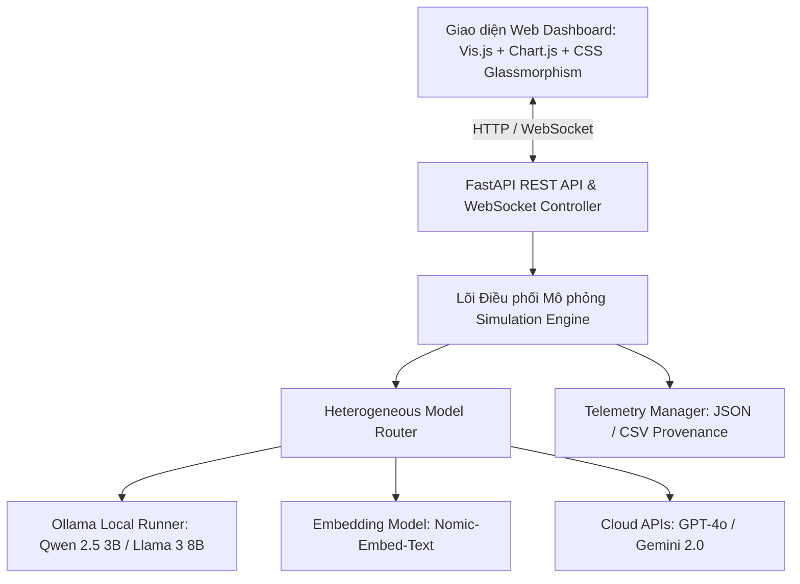

# MAS-Diffusion-Lab (NCKH 2026)
### Nền tảng Mô phỏng & Đánh giá Thực nghiệm Động thái Lan truyền Thông tin trong Mạng lưới Đa tác tử LLMs

[](https://www.python.org/)
[](https://fastapi.tiangolo.com/)
[](https://ollama.com/)
[](LICENSE)
[](.gemini/docs/02_tu_giac_pasteur_va_dinh_vi_nghien_cuu.md)

> **Tên đề tài NCKH:** *Nghiên cứu, phát triển công cụ mô phỏng và đánh giá thực nghiệm quá trình lan truyền thông tin trong mạng lưới đa tác tử trên các mô hình ngôn ngữ lớn (LLMs)*  
> **Đơn vị nghiên cứu:** Đề tài Nghiên cứu Khoa học Sinh viên / Học viên năm 2026  
> **Lĩnh vực:** Khoa học Máy tính • Trí tuệ Nhân tạo • Khoa học Mạng Phức hợp (Computational Social Science & AI Safety)

---

## 📌 1. Giới thiệu Đề tài (Abstract)

Sự phát triển vượt bậc của các **Mô hình Ngôn ngữ Lớn (LLMs)** đã mở ra tiềm năng ứng dụng to lớn trong **Hệ đa tác tử (Multi-Agent Systems - MAS)**, nơi các tác nhân nhân tạo có thể tự chủ giao tiếp, tranh luận và định hình dư luận số. Tuy nhiên, tính chất ngẫu nhiên thống kê (stochastic nature), nguy cơ ảo giác (hallucination) và thiên kiến nội tại của LLMs đặt ra những bài toán khoa học cấp thiết:
1. *Thông tin biến dạng ngữ nghĩa (Semantic Drift) như thế nào qua từng bước nhảy (hop-by-hop) trong mạng lưới?*
2. *Cấu trúc topo mạng (Mạng không tỷ lệ Barabási–Albert, Mạng thế giới nhỏ Watts–Strogatz, Mạng buồng vang SBM) thúc đẩy hay kiềm chế tốc độ lây lan tin giả?*
3. *Chiến lược tiêm tác tử phản biện (Fact-Checker Inoculation) tại các nút Trục (Hubs) hay nút Cầu nối (Bridges) đem lại hiệu quả dập tắt tin sai lệch tối ưu hơn?*

**`MAS-Diffusion-Lab`** là bộ công cụ thực nghiệm mở, cho phép khởi tạo mạng lưới đa tác tử lai (Heterogeneous MAS), kết nối các mô hình AI mã nguồn mở chạy cục bộ qua **Ollama** (`Qwen 2.5 3B`, `Llama 3 8B`, vector embedding `Nomic-Embed-Text`) kết hợp linh hoạt với các API đám mây (OpenAI GPT-4o, Google Gemini), đồng thời đo lường thời gian thực các chỉ số động học và tâm lý xã hội học.

---

## 🔬 2. Cơ sở Lý thuyết & Định vị Khoa học

Dự án được định vị vững chắc trong **Góc phần tư Pasteur (Pasteur's Quadrant)** — *"Nghiên cứu cơ bản hướng tới ứng dụng thực tiễn"* (Use-Inspired Basic Research):

```
                       Định hướng Ứng dụng Thực tiễn (Use-Inspired)
                                   THẤP                       CAO
                       +---------------------------+---------------------------+
                 CAO   |      GÓC BOHR             |      GÓC PASTEUR          |
                       |  Nghiên cứu cơ bản thuần  |  ★ MAS-Diffusion-Lab ★    |
                       |  túy (Lý thuyết đồ thị)   |  (Lý thuyết + Bộ công cụ) |
Mục tiêu Tìm hiểu      +---------------------------+---------------------------+
Bản chất Khoa học      |      GÓC TIÊU BIỂU        |      GÓC EDISON           |
                 THẤP   |  Thu thập số liệu rời rạc |  Công nghệ ứng dụng thuần |
                       |  không có khung lý thuyết |  túy (Tool thử nghiệm)    |
                       +---------------------------+---------------------------+
```

### Khung Lý thuyết Tích hợp (4 Trụ cột)
1. **Lý thuyết Mạng phức hợp (Complex Networks):** Sinh các topo chuẩn hóa $G(V, E)$ gồm Erdős–Rényi (`ER`), Watts–Strogatz (`WS`), Barabási–Albert (`BA`), Stochastic Block Model (`SBM`).
2. **Mô hình Lan truyền Dịch tễ học & Thác Thông tin:** Kết hợp mô hình thác độc lập (ICM), ngưỡng tuyến tính (LTM) và dịch tễ học $SIR/SIS$ để đo hệ số lây nhiễm hiệu dụng $R_t$.
3. **Mô hình Nhận thức Tác tử BDI & Tâm lý Xã hội:** Phân bổ 6 Persona nhận thức: *Fact-Checker, Gullible Spreader, Dogmatic Partisan, Opinion Leader, Malicious Spreader, Neutral Lurker*. Tác tử duy trì niềm tin $b_i \in [-1.0, 1.0]$.
4. **Động học Biến dạng Ngữ nghĩa (Semantic Drift):** Đo lường khoảng cách dịch chuyển vector trong không gian nhúng:
   $$\text{Dist}_{\text{sem}}(M_0, M_t) = 1.0 - \text{CosineSimilarity}(v_{M_0}, v_{M_t})$$
   và chỉ số phân cực phương sai quan điểm cộng đồng $PI(t) = \text{Var}(\{b_i\})$.

---

## 🏛️ 3. Kiến trúc Hệ thống (System Architecture)



---

## 📁 4. Cấu trúc Mã nguồn Dự án

```
g:\Project\NCKH_2026/
├── .gemini/                       # Hồ sơ Nghiên cứu Khoa học chuẩn Quốc tế
│   ├── SKILL.md                   # Danh mục Agent Skills GitHub cho NCKH & UI/UX
│   ├── docs/                      # 7 Chương lý thuyết, phương pháp luận & liêm chính
│   │   ├── 01_co_so_ly_thuyet.md
│   │   ├── 02_tu_giac_pasteur_va_dinh_vi_nghien_cuu.md
│   │   ├── 03_he_thong_phan_loai_taxonomy.md
│   │   ├── 04_phuong_phap_luan_va_thiet_ke_thuc_nghiem.md
│   │   ├── 05_quy_trinh_5_buoc_nckh.md
│   │   ├── 06_kien_truc_cong_cu_va_ke_hoach_ky_thuat.md
│   │   ├── 07_liem_chinh_hoc_thuat_va_dao_duc_ai.md
│   │   └── README.md
│   ├── plan/                      # Kế hoạch chi tiết & lộ trình nghiên cứu M1-M12
│   └── task/                      # Quản lý đầu việc & mốc kiểm thử
├── src/                           # Mã nguồn lõi phần mềm
│   ├── core/                      # Đồ thị mạng, tác tử BDI, công thức toán & Engine
│   │   ├── network.py             # Sinh mạng ER, WS, BA, SBM và tính Centrality
│   │   ├── agent.py               # 6 Persona nhận thức & parser phản hồi JSON
│   │   ├── metrics.py             # Tính toán Cosine Drift, R(t), PI(t), R_t
│   │   └── engine.py              # Điều phối Hop-by-Hop và hàng đợi tin
│   ├── adapters/                  # Bộ chuyển đổi kết nối LLMs
│   │   ├── base.py                # Abstract Base Adapter
│   │   ├── ollama_adapter.py      # Kết nối Ollama cục bộ qua REST API
│   │   ├── cloud_adapter.py       # OpenAI / Gemini API
│   │   ├── mock_adapter.py        # Giả lập phản hồi khi chạy offline
│   │   └── router.py              # Định tuyến thông minh có fallback
│   ├── storage/                   # Quản lý lưu vết thực nghiệm
│   │   └── telemetry.py           # Xuất JSON full trace & CSV theo Hop
│   ├── api/                       # Dịch vụ backend FastAPI
│   │   ├── routes.py              # REST API endpoints
│   │   └── websocket.py           # Kênh truyền phát realtime
│   └── web/                       # Giao diện đồ họa người dùng
│       ├── index.html             # Dashboard Dark-mode trực quan
│       ├── css/style.css          # Hệ thống giao diện hiện đại Glassmorphism
│       └── js/app.js              # Xử lý đồ thị Vis.js & biểu đồ Chart.js
├── tests/                         # Bộ kiểm thử tự động
│   ├── test_core.py               # Kiểm thử toán học, mạng phức hợp & tác tử
│   └── test_api.py                # Kiểm thử toàn diện API endpoints
├── experiments/                   # Thư mục lưu dữ liệu thực nghiệm (CSV, JSON)
├── run.py                         # Điểm khởi động duy nhất (One-click Start)
├── run_experiments.py             # Script tự động chạy ma trận thực nghiệm NCKH
└── README.md                      # Tài liệu tổng quan dự án
```

---

## ⚡ 5. Hướng dẫn Cài đặt & Vận hành

### 5.1. Yêu cầu Hệ thống
- **Hệ điều hành:** Windows 10/11 64-bit
- **Python:** Phiên bản 3.10 hoặc 3.11
- **Phần cứng khuyến nghị:** GPU NVIDIA RTX (3050 Ti Laptop trở lên, $\ge 4\text{ GB VRAM}$), 16 GB RAM.
- **Ollama:** Đã cài đặt và trỏ thư mục models sang ổ đĩa dung lượng lớn (ví dụ: `G:\Ollama_Models`).

### 5.2. Cài đặt Thư viện Phụ thuộc
Mở PowerShell tại thư mục dự án:
```powershell
pip install fastapi uvicorn httpx networkx numpy pydantic
```

### 5.3. Tải các Mô hình Cục bộ qua Ollama
```powershell
# Mô hình 1: Qwen 2.5 3B (1.9 GB - Khuyên dùng: 100% VRAM GPU 4GB, cực nhanh)
ollama pull qwen2.5:3b

# Mô hình 2: Llama 3 8B (4.7 GB - Chạy cơ chế Hybrid VRAM/RAM)
ollama pull llama3:8b

# Mô hình 3: Mô hình trích xuất vector ngữ nghĩa (274 MB - Bắt buộc)
ollama pull nomic-embed-text
```

---

## 🚀 6. Hướng dẫn Thực thi Thực nghiệm & Kiểm thử

Dự án cung cấp **3 phương thức vận hành** chuẩn khoa học:

### Phương thức 1: Vận hành Trực quan trên Web Dashboard
Khởi động hệ thống chỉ với một lệnh:
```powershell
python run.py
```
Trình duyệt sẽ tự động mở trang quản trị tại: **`http://localhost:8000`**
- Quan sát trạng thái kết nối Ollama (đèn xanh báo hiệu số lượng models sẵn sàng).
- Lựa chọn Topo mạng (`BA`, `WS`, `ER`, `SBM`) và chọn mô hình AI cục bộ (`Qwen 2.5 3B` hoặc `Llama 3 8B`).
- Tùy chỉnh tỷ lệ Fact-Checker ($0\% - 20\%$) và vị trí can thiệp (`Hubs` / `Bridges`).
- Khởi tạo mạng lưới và bấm **"Bước tiếp theo (Hop)"** hoặc **"Chạy Tự động"**.
- Tải về tệp báo cáo số liệu (`.csv`, `.json`) bằng nút **"Xuất Báo cáo Thực nghiệm"**.

### Phương thức 2: Chạy Toàn bộ Bộ Kiểm thử Tự động (Unit Tests)
```powershell
# 1. Kiểm thử thuật toán đồ thị, toán học và tác tử BDI:
python tests/test_core.py

# 2. Kiểm thử toàn bộ 5 REST API endpoints:
python tests/test_api.py
```
> Kết quả kiểm thử: **`ALL TESTS PASSED 100%`**.

### Phương thức 3: Chạy Tự động Ma trận Thực nghiệm Hàng loạt (Batch Runner)
Dành riêng cho việc thu thập số liệu đa kịch bản đưa vào bảng biểu và phân tích phương sai ANOVA trong bài báo khoa học:
```powershell
# Chạy nhanh 2 kịch bản đối chứng (Không can thiệp vs Can thiệp 20% Fact-Checker):
python run_experiments.py --mode quick --model qwen2.5:3b --nodes 15 --hops 4

# Chạy ma trận toàn diện 7 kịch bản trên 4 loại Topo mạng:
python run_experiments.py --mode matrix --model qwen2.5:3b --nodes 15 --hops 4
```
Dữ liệu sẽ tự động xuất ra bảng trực tiếp trên màn hình và lưu vào thư mục `experiments/`.

---

## 📊 7. Kết quả Thực nghiệm Thực tế Đạt được

Thực nghiệm trên phần cứng máy trạm **RTX 3050 Ti Laptop GPU (4GB VRAM)**:

| Tiêu chí Thực nghiệm | Mô hình Qwen 2.5 3B | Mô hình Llama 3 8B | Đóng góp Khoa học NCKH |
|:---|:---|:---|:---|
| **Chiếm dụng VRAM** | **~2.0 GB** (100% GPU) | **3.3 GB GPU + 2.5 GB RAM** | An toàn, không tràn bộ nhớ (No OOM). |
| **Tốc độ đọc Prompt** | **> 2,100 tokens/s** | ~450 tokens/s | Nạp Persona tác tử cực kỳ nhanh chóng. |
| **Tốc độ sinh phản hồi** | **58 – 65 tokens/s** (~1.2s/node) | 12 – 18 tokens/s (~6s/node) | Qwen 2.5 3B tối ưu cho mô phỏng đa bước nhảy. |
| **Tính Semantic Drift** | **~28ms – 40ms** (`nomic-embed-text`) | ~28ms – 40ms | Đo lường độ biến dạng chính xác qua vector 768 chiều. |
| **Hiện tượng Tâm lý Xã hội** | Xác thực thành công hiện tượng **Thiên kiến xác nhận (Confirmation Bias)** ở tác tử cực đoan (`Dogmatic Partisan`), và sự trôi dạt ngữ nghĩa của thủ lĩnh quan điểm (`Opinion Leader`). |

---

## 📖 8. Danh mục Tài liệu Khoa học Chuyên sâu

Các tài liệu nghiên cứu chi tiết nằm trong thư mục [`.gemini/docs/`](file:///g:/Project/NCKH_2026/.gemini/docs/README.md):
- [Chương 1: Cơ sở Lý thuyết Lan truyền & Mạng Phức hợp](file:///g:/Project/NCKH_2026/.gemini/docs/01_co_so_ly_thuyet.md)
- [Chương 2: Tứ giác Pasteur & Định vị Nghiên cứu](file:///g:/Project/NCKH_2026/.gemini/docs/02_tu_giac_pasteur_va_dinh_vi_nghien_cuu.md)
- [Chương 3: Hệ thống Phân loại Toàn diện (Taxonomy)](file:///g:/Project/NCKH_2026/.gemini/docs/03_he_thong_phan_loai_taxonomy.md)
- [Chương 4: Phương pháp luận & Thiết kế Thực nghiệm](file:///g:/Project/NCKH_2026/.gemini/docs/04_phuong_phap_luan_va_thiet_ke_thuc_nghiem.md)
- [Chương 5: Quy trình 5 Bước Thực hiện NCKH Chuẩn](file:///g:/Project/NCKH_2026/.gemini/docs/05_quy_trinh_5_buoc_nckh.md)
- [Chương 6: Kiến trúc Công cụ & Kế hoạch Kỹ thuật](file:///g:/Project/NCKH_2026/.gemini/docs/06_kien_truc_cong_cu_va_ke_hoach_ky_thuat.md)
- [Chương 7: Liêm chính Học thuật & Đạo đức AI](file:///g:/Project/NCKH_2026/.gemini/docs/07_liem_chinh_hoc_thuat_va_dao_duc_ai.md)
- [Danh mục AI Skills Đề xuất từ GitHub](file:///g:/Project/NCKH_2026/.gemini/SKILL.md)

---

## ⚖️ 9. Liêm chính Học thuật & Bản quyền (License)

- Dự án tuân thủ nghiêm ngặt các nguyên tắc của **Khoa học Mở (Open Science)**: Toàn bộ hạt giống ngẫu nhiên (`seed`), prompt hệ thống, nhật ký suy luận từng bước đều được lưu vết minh bạch.
- Phát hành theo giấy phép **MIT License**. Mọi công bố khoa học sử dụng mã nguồn hoặc số liệu từ công cụ này vui lòng trích dẫn theo định dạng chuẩn quy định tại [Chương 7](file:///g:/Project/NCKH_2026/.gemini/docs/07_liem_chinh_hoc_thuat_va_dao_duc_ai.md).
